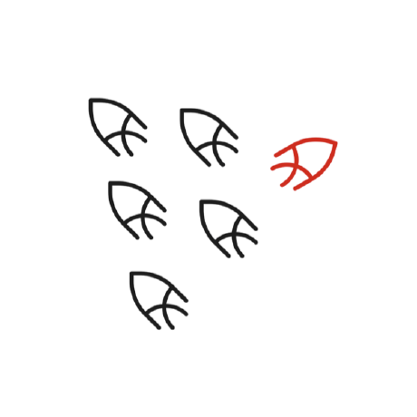
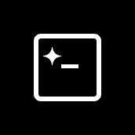
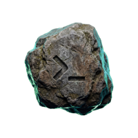
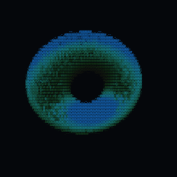

<!-- <CENTERED SECTION FOR GITHUB DISPLAY> -->

<div align="center">

[](https://tokscale.ai)

</div>

> 複数のプラットフォームでAIコーディングアシスタントのトークン使用量とコストを追跡するための高性能CLIツールと可視化ダッシュボード。

> [!TIP]
>
> **v2 リリース — ネイティブ Rust TUI、クロスプラットフォーム対応など。** <br />
> 毎週新しいオープンソースプロジェクトを公開しています。お見逃しなく。
>
> | [](https://github.com/junhoyeo) | GitHubで[@junhoyeo](https://github.com/junhoyeo)をフォローして、他のプロジェクトもチェックしてください。AI、インフラ、その他様々な分野で開発しています。 |
> | :-----| :----- |
> [](https://discord.gg/h6DUGWdBbm) | [Discord](https://discord.gg/h6DUGWdBbm)に参加しよう — 世界最高のバイバーたちと一緒に。 |
> [](https://github.com/sponsors/junhoyeo) | [GitHub Sponsors](https://github.com/sponsors/junhoyeo)を通じて、Tokscaleの継続的な開発をご支援ください。 |

<div align="center">

[](https://github.com/junhoyeo/tokscale/releases)
[](https://www.npmjs.com/package/tokscale)
[](https://github.com/junhoyeo/tokscale/graphs/contributors)
[](https://github.com/junhoyeo/tokscale/network/members)
[](https://github.com/junhoyeo/tokscale/stargazers)
[](https://github.com/junhoyeo/tokscale/issues)
[](https://github.com/junhoyeo/tokscale/blob/master/LICENSE)
[](https://github.com/junhoyeo/tokscale/issues/403)

[🇺🇸 English](README.md) | [🇰🇷 한국어](README.ko.md) | [🇯🇵 日本語](README.ja.md) | [🇨🇳 简体中文](README.zh-cn.md)

</div>

<!-- </CENTERED SECTION FOR GITHUB DISPLAY> -->

| Overview | Models |
|:---:|:---:|
|  |  | 

| Daily Summary | Stats |
|:---:|:---:|
|  |  | 

| Frontend (3D Contributions Graph) | Wrapped 2025 |
|:---:|:---:|
| <a href="https://tokscale.ai"></a> | <a href="#wrapped-2025"></a> |

> **[`bunx tokscale@latest submit`](#ソーシャルプラットフォームコマンド)を実行して、使用量データをリーダーボードに送信し、公開プロフィールを作成しましょう！**

## 概要

**Tokscale**は以下のプラットフォームからのトークン消費を監視・分析するのに役立ちます：

| ロゴ | クライアント | データ場所 |
|------|----------|---------------|
|  | [OpenCode](https://github.com/sst/opencode) | `~/.local/share/opencode/opencode.db` (1.2+、`opencode-stable.db` など全チャンネル対応) または `~/.local/share/opencode/storage/message/` |
|  | [Claude Code](https://docs.anthropic.com/en/docs/claude-code) | `~/.claude/projects/` および `~/.claude/transcripts/` |
|  | [OpenClaw](https://openclaw.ai/) | `~/.openclaw/agents/` (`*/agent/openclaw-agent.sqlite` + `*/sessions/*.jsonl`; + レガシー: `.clawdbot`, `.moltbot`, `.moldbot`) |
|  | [Codex CLI](https://github.com/openai/codex) | `~/.codex/sessions/` |
|  | [Prime Agent](https://github.com/PrimeIntellect-ai/prime-agent) | `~/.prime/agent/sessions/` および `~/.prime/agent/session-artifacts/`（RLM 子セッション） |
|  | [Sakana Fugu](https://sakana.ai/fugu/) | Codex 経由で追跡 — `~/.codex/sessions/*.jsonl` (`model_provider: sakana`) |
|  | [GitHub Copilot CLI](https://docs.github.com/en/copilot/how-tos/use-copilot-agents/use-the-github-copilot-coding-agent-in-cli) | `~/.copilot/session-store.db`（CLI 使用イベント; OTEL 不要）、`~/.copilot/otel/*.jsonl` (+ `COPILOT_OTEL_FILE_EXPORTER_PATH`)、`~/.copilot/data.db` |
|  | [Hermes Agent](https://github.com/NousResearch/hermes-agent) | `$HERMES_HOME/state.db` および `$HERMES_HOME/profiles/*/state.db`（フォールバック: `~/.hermes/...`） |
|  | [Gemini CLI](https://github.com/google-gemini/gemini-cli) | `$GEMINI_CLI_HOME/tmp/*/chats/*.json`（フォールバック: `~/.gemini/tmp/*/chats/*.json`） |
|  | [Cursor IDE](https://cursor.com/) | Cursor API のエクスポートを `~/.config/tokscale/cursor-cache/usage*.csv` にキャッシュ（デスクトップ自動ログインまたは Cookie 貼り付け；`~/.cursor` ではない） |
|  | [Amp (AmpCode)](https://ampcode.com/) | `~/.local/share/amp/threads/` |
|  | [Codebuff](https://codebuff.com/) | `~/.config/manicode/` (+ `manicode-dev`、`manicode-staging`; `CODEBUFF_DATA_DIR` でオーバーライド可能) |
|  | [Freebuff](https://github.com/CodebuffAI/freebuff) | Codebuff と同じ `~/.config/manicode/` を共有（同一ランタイム）；トークン使用量はトランスクリプトから推定（ローカル使用量なし；`FREEBUFF_DATA_DIR` でオーバーライド可能） |
|  | [Droid (Factory Droid)](https://factory.ai/) | `~/.factory/sessions/` |
|  | [Pi](https://github.com/badlogic/pi-mono) | `~/.pi/agent/sessions/` |
|  | [omp (Oh My Pi)](https://github.com/can1357/oh-my-pi) | `~/.omp/agent/sessions/**/*.jsonl` |
|  | [Senpi (OmO Native)](https://github.com/code-yeongyu/senpi) | `~/.senpi/agent/sessions/` (`SENPI_CODING_AGENT_DIR` でオーバーライド可能) |
|  | [Kimchi Coding](https://kimchi.dev/) | `~/.config/kimchi/harness/sessions/`（`KIMCHI_CODING_AGENT_DIR` でオーバーライド可能） |
|  | [Reasonix](https://github.com/esengine/DeepSeek-Reasonix) | `~/.reasonix/stats/*.jsonl`（`REASONIX_STATE_HOME` または `REASONIX_HOME` でオーバーライド可能） |
|  | [Kimi CLI](https://github.com/MoonshotAI/kimi-cli) / [Kimi Code](https://github.com/MoonshotAI/kimi-code) | kimi-cli: `~/.kimi/sessions/` kimi-code: `~/.kimi-code/sessions/` (`KIMI_CODE_HOME` でオーバーライド可能) kimi-work: デスクトップ app-data ルート（自動検出） |
|  | [Qwen CLI](https://github.com/QwenLM/qwen-cli) | `~/.qwen/projects/` |
|  | [Roo Code](https://github.com/RooCodeInc/Roo-Code) | `~/.config/Code/User/globalStorage/rooveterinaryinc.roo-cline/tasks/` (+ server: `~/.vscode-server/data/User/globalStorage/rooveterinaryinc.roo-cline/tasks/`) |
|  | [Kilo](https://github.com/Kilo-Org/kilocode) | `~/.config/Code/User/globalStorage/kilocode.kilo-code/tasks/` (+ server: `~/.vscode-server/data/User/globalStorage/kilocode.kilo-code/tasks/`) |
|  | [Kilo CLI](https://github.com/nicepkg/kilo) | `~/.local/share/kilo/kilo.db` |
|  | [Mux](https://github.com/coder/mux) | `~/.mux/sessions/` |
|  | [Crush](https://crush.ai/) | `$XDG_DATA_HOME/crush/projects.json`（プロジェクトレジストリ。フォールバック: `~/.local/share/crush/projects.json`） |
|  | [Goose](https://github.com/aaif-goose/goose) | `~/.local/share/goose/sessions/sessions.db` (+ macOS Application Support、レガシー Block/goose パス; `GOOSE_PATH_ROOT` でオーバーライド可能) |
|  | [Google Antigravity](https://antigravity.google/) | `tokscale antigravity sync` で `~/.config/tokscale/antigravity-cache/sessions/*.jsonl` にキャッシュ（ローカル言語サーバ RPC を使用） |
|  | [Antigravity CLI](https://antigravity.google/) | `~/.gemini/antigravity-cli/conversations/*.db`（Gemini ホームは `GEMINI_CLI_HOME` でオーバーライド可能；ローカル SQLite を直接読み取るため `antigravity sync` は不要） |
|  | [Trae IDE](https://www.trae.ai/) / [Trae Solo](https://www.trae.ai/solo)（国際版） | `tokscale trae sync` で `~/.config/tokscale/trae-cache/sessions/*.json` にキャッシュ（公式 API のアカウント単位使用量） |
|  | [Warp](https://www.warp.dev/) / Oz | `tokscale warp sync` で `~/.config/tokscale/warp-cache/usage.json` にキャッシュ（集計リクエスト数と使用金額のみ。トークントランスクリプトは含まない） |
|  | Grok Build | `$GROK_HOME/sessions/*/*/updates.jsonl`（フォールバック: `~/.grok/sessions/*/*/updates.jsonl`） |
|  | [Zed Agent](https://zed.dev/docs/ai/agent-panel) | `~/.local/share/zed/threads/threads.db`（macOS: `~/Library/Application Support/Zed/threads/threads.db`; Windows: `%LOCALAPPDATA%/Zed/threads/threads.db`; ホスティング済み Zed モデル専用、外部 ACP エージェントは対象外） |
|  | Kiro | `~/.kiro/sessions/cli/*.json`（+ `*.jsonl`）、`~/.local/share/kiro-cli/data.sqlite3`（macOS: `~/Library/Application Support/kiro-cli/data.sqlite3`）、および Kiro IDE の globalStorage スナップショット（`Kiro/User/globalStorage/kiro.kiroagent`; macOS は Application Support、Linux は `~/.config/Kiro`、Windows は `%APPDATA%\Kiro`） |
|  | [Cline](https://github.com/cline/cline) | VS Code globalStorage のタスクディレクトリ（Linux: `~/.config/Code/...`; macOS: `~/Library/Application Support/Code/...`; Windows: `%APPDATA%\Code\...`; サーバー: `~/.vscode-server/data/User/globalStorage/saoudrizwan.claude-dev/tasks/`）+ Cline CLI セッション（利用可能な最初のルートを次の順序で選択: `$CLINE_SESSION_DATA_DIR`、`$CLINE_DATA_DIR/sessions/`、`$CLINE_DIR/data/sessions/`、フォールバック `~/.cline/data/sessions/`；空白または空白文字のみの環境変数は無視） |
|  | [gajae-code (gjc)](https://github.com/Yeachan-Heo/gajae-code) | `~/.gjc/agent/sessions/`（`GJC_CODING_AGENT_DIR`、`GJC_CONFIG_DIR`、`PI_CONFIG_DIR` でオーバーライド可能；Linux/macOS では `$XDG_DATA_HOME/gjc/sessions/` も解決） |
|  | [Cherry Studio](https://cherry-ai.com/) | `%APPDATA%\CherryStudio\Data\Agents\.claude\projects\*.jsonl` と旧 `%APPDATA%\CherryStudio\.claude\projects\*.jsonl`（macOS: `~/Library/Application Support/CherryStudio/Data/Agents/.claude/projects/`；Linux: `$XDG_CONFIG_HOME/CherryStudio/Data/Agents/.claude/projects/`；Agent/Claude Code モードのトランスクリプト、V2 ルート優先・旧ルートは移行前履歴） |
|  | [LM Studio](https://lmstudio.ai/) | `~/.lmstudio/server-logs/**/*.log`（`LM_STUDIO_HOME` 対応、Chat Completions と Responses API の最終応答 usage のみ。プロンプトと応答本文は保持せず、ローカル推論のコストは $0） |
|  | [Unsloth Studio](https://github.com/unslothai/unsloth) | `$UNSLOTH_STUDIO_HOME/studio.db`（フォールバック: `~/.unsloth/studio/studio.db`。内部チャットと認証済み API の正確な推論使用量を読み取り、メッセージ本文は読み取らない。トレーニング指標は対象外で、ローカル推論のコストは $0） |
|  | [Hindsight](https://github.com/vectorize-io/hindsight) | `$HINDSIGHT_HOME/usage/*.jsonl`（フォールバック: `~/.hindsight/usage/*.jsonl`、`tokscale hindsight sync` で同期） |
|  | [Jcode](https://github.com/1jehuang/jcode) | `~/.jcode/sessions/session_*.json` + `session_*.journal.jsonl` サイドカー（`JCODE_HOME` で上書き可） |
|  | [MiMo Code](https://github.com/XiaomiMiMo/MiMo-Code) | `~/.local/share/mimocode/mimocode.db`（XDG データディレクトリ；SQLite） |
|  | Xiaomi MiMo AI（デスクトップ） | MiMo Code と同じ `~/.local/share/mimocode/mimocode.db`；`session.version` が `desktop-` で始まるセッションは `micode-desktop` として区別 |
|  | [Junie](https://www.jetbrains.com/junie/) | `~/.junie/sessions/*/events.jsonl` |
|  | [Command Code](https://github.com/CommandCodeAI/command-code) | `~/.commandcode/projects/**/*.jsonl`（トークン使用量はトランスクリプトから約4文字/トークンで推定；ディスクには永続化されない） |
|  | [ZCode](https://zcode.z.ai/) | `~/.zcode/cli/db/db.sqlite`（v2 使用量データベース）および `~/.zcode/projects/**/*.jsonl`（従来の記録） |
|  | [OpenCodeReview](https://github.com/alibaba/open-code-review) | `~/.opencodereview/sessions/**/*.jsonl` |
|  | [CodeBuddy](https://www.codebuddy.cn/docs/cli/overview)（CLI・IDE・VS Code プラグイン） | `~/.codebuddy/projects/**/*.jsonl` + 拡張機能ログ |
|  | WorkBuddy | `~/.workbuddy/projects/**/*.jsonl`（5.5+ は `~/.workbuddy-ai/` もスキャン） + SQLite フォールバック |
|  | [Devin CLI](https://devin.ai/) | `~/.local/share/devin/cli/sessions.db`（SQLite） |
|  | [Devin Desktop](https://devin.ai/) | ACP イベント：macOS `~/Library/Application Support/Devin/User/acp-events/`、Linux `~/.config/Devin/User/acp-events/`、Windows `%APPDATA%\Devin\User\acp-events\` |
|  | [Augment Code](https://www.augmentcode.com/)（Auggie CLI） | `~/.augment/sessions/*.json` |
|  | [Synthetic](https://synthetic.new/) | `hf:`モデルや`synthetic`プロバイダを検出して他ソースから再帰属（+ [Octofriend](https://github.com/synthetic-lab/octofriend): `~/.local/share/octofriend/sqlite.db`） |
|  | [DeepSeek Harness](https://github.com/deepseek-ai/DeepSeek-Harness) | `~/.dsh/sessions/**/session.jsonl.zstd`（非圧縮で書き出された場合は `session.jsonl`、バージョン付きの `session.v<N>.jsonl[.zstd]` 表記も読み取り、`DSH_HOME` で上書き可） |
|  | [fx](https://github.com/vercel-labs/fx) | `~/.fx/sessions/<sessionId>/usage-v2.json` (セッション単位の集計) |
|  | [Muse Code](https://dev.meta.ai/docs/muse-code) | `~/.local/share/muse/sessions/**/session.jsonl`（Windows も共通の XDG 形式パス。`subagent/<uuid>/` 配下のサブエージェント記録を含む） |

[🚅 LiteLLMの価格データ](https://github.com/BerriAI/litellm)を使用してリアルタイム価格計算を提供し、階層型価格モデルとキャッシュトークン割引をサポートしています。

### なぜ「Tokscale」？

[](https://tokscale.ai)

このプロジェクトは **[カルダシェフ・スケール(Kardashev Scale)](https://ja.wikipedia.org/wiki/%E3%82%AB%E3%83%AB%E3%83%80%E3%82%B7%E3%82%A7%E3%83%95%E3%83%BB%E3%82%B9%E3%82%B1%E3%83%BC%E3%83%AB)** に触発されています。これは天体物理学者ニコライ・カルダシェフがエネルギー消費量に基づいて文明の技術的発展レベルを測定するために提案した方法です。タイプI文明は惑星上で利用可能なすべてのエネルギーを活用し、タイプIIは恒星の全出力を捕捉し、タイプIIIは銀河全体のエネルギーを支配します。

AI支援開発の時代において、**トークンは新しいエネルギー**です。トークンは私たちの思考力を動かし、生産性を高め、創造的な成果を駆動します。カルダシェフ・スケールが宇宙規模でエネルギー消費を追跡するように、Tokscaleは AI増強開発のランクを上げながらトークン消費を測定します。カジュアルユーザーでも毎日数百万のトークンを消費する人でも、Tokscaleは惑星級開発者から銀河級コードアーキテクトへの旅を視覚化するのに役立ちます。

## 目次

- [概要](#概要)
  - [なぜ「Tokscale」？](#なぜtokscale)
- [機能](#機能)
- [インストール](#インストール)
  - [クイックスタート](#クイックスタート)
  - [前提条件](#前提条件)
  - [開発環境セットアップ](#開発環境セットアップ)
  - [ネイティブモジュールのビルド](#ネイティブモジュールのビルド)
- [使用方法](#使用方法)
  - [基本コマンド](#基本コマンド)
  - [TUI機能](#tui機能)
  - [プラットフォーム別フィルタリング](#プラットフォーム別フィルタリング)
  - [日付フィルタリング](#日付フィルタリング)
  - [価格検索](#価格検索)
  - [カスタム価格オーバーライド](#カスタム価格オーバーライド)
  - [ソーシャルプラットフォームコマンド](#ソーシャルプラットフォームコマンド)
  - [Autosubmit](#autosubmit)
  - [Cursor IDEコマンド](#cursor-ideコマンド)
  - [Antigravity コマンド](#antigravity-コマンド)
  - [Trae コマンド](#trae-コマンド)
  - [Warp/Oz コマンド](#warpoz-コマンド)
  - [タスク別レポート](#タスク別レポート)
  - [サブスクリプション使用量](#サブスクリプション使用量)
  - [出力例](#出力例--lightバージョン)
  - [設定](#設定)
  - [環境変数](#環境変数)
- [フロントエンド可視化](#フロントエンド可視化)
  - [機能](#機能-1)
  - [フロントエンドの実行](#フロントエンドの実行)
- [ソーシャルプラットフォーム](#ソーシャルプラットフォーム)
  - [機能](#機能-2)
  - [GitHubプロフィール埋め込みウィジェット](#githubプロフィール埋め込みウィジェット)
  - [GitHubプロフィールバッジ](#githubプロフィールバッジ)
  - [はじめに](#はじめに)
  - [データ検証](#データ検証)
- [Wrapped 2025](#wrapped-2025)
  - [コマンド](#コマンド)
  - [含まれる内容](#含まれる内容)
- [開発](#開発)
  - [前提条件](#前提条件-1)
  - [実行方法](#実行方法)
  - [コンテナセットアップ](#コンテナセットアップ)
- [サポートプラットフォーム](#サポートプラットフォーム)
  - [ネイティブモジュールターゲット](#ネイティブモジュールターゲット)
  - [Windowsサポート](#windowsサポート)
- [セッションデータ保持](#セッションデータ保持)
- [データソース](#データソース)
- [価格](#価格)
- [コントリビューション](#コントリビューション)
  - [開発ガイドライン](#開発ガイドライン)
- [謝辞](#謝辞)
- [ライセンス](#ライセンス)

## 機能

- **インタラクティブTUIモード** - Ratatuiによる美しいターミナルUI（デフォルトモード）
  - 10のインタラクティブビュー：概要、Usage、モデル、日別、時間別、月別、セッション、プロジェクト、統計、エージェント（オプションの Minutely ビューを `minutelyTabEnabled` でオプトイン可能）
  - キーボード＆マウスナビゲーション
  - 設定可能なカラーテーマのGitHubスタイル貢献グラフ
  - リアルタイムフィルタリングとソート
  - ゼロフリッカーレンダリング
- **マルチプラットフォームサポート** - OpenCode、Claude Code、Codex CLI、Prime Agent、Copilot CLI、Cursor IDE、Gemini CLI、Amp、Codebuff、Droid、OpenClaw、Hermes Agent、Pi、Kimchi Coding、Reasonix、Kimi CLI、Kimi Work、Qwen CLI、Roo Code、Kilo、Mux、Kilo CLI、Crush、Goose、Antigravity、Antigravity CLI、Zed、Kiro、Trae、Warp/Oz、Cline、Gajae-Code、Grok Build、Jcode、MiMo Code、Xiaomi MiMo AI、Command Code、Junie、ZCode、OpenCodeReview、CodeBuddy、WorkBuddy、Devin CLI、Devin Desktop、Augment Code、Synthetic、Cherry Studio、LM Studio、Unsloth Studio、Hindsight、fx、Oh My Pi、Muse Codeの使用量を追跡
- **リアルタイム価格** - 1時間ディスクキャッシュ付きでLiteLLMから現在の価格を取得；OpenRouter自動フォールバックと新規モデル向けCursor価格サポート
- **詳細な内訳** - 入力、出力、キャッシュ読み書き、推論トークン追跡
- **ネイティブRustコア** - 10倍高速な処理のため、すべての解析と集計をRustで実行
- **Web可視化** - 2Dと3Dビューのインタラクティブ貢献グラフ
- **柔軟なフィルタリング** - プラットフォーム、日付範囲、年別フィルタリング
- **タスク別レポート** - マルチバックエンド対応（Apple FM、Claude、Codex、Gemini、Kiro、MiniMax）の LLM によるセッション要約とタスクグルーピング
- **JSONエクスポート** - 外部可視化ツール用のデータ生成
- **ソーシャルプラットフォーム** - 使用量の共有、リーダーボード競争、公開プロフィール閲覧

## インストール

### クイックスタート

```bash
# npxで直接実行
npx tokscale@latest

# またはbunxを使用
bunx tokscale@latest

# またはエイリアスをインストールせずにDenoを使用
deno x npm:tokscale@latest

# ライトモード（テーブルレンダリングのみ）
npx tokscale@latest --light
```

これだけです！セットアップ不要で完全なインタラクティブTUI体験が得られます。

> **パッケージ構造**: `tokscale`は`@tokscale/cli`をインストールするエイリアスパッケージです（[`swc`](https://www.npmjs.com/package/swc)のように）。どちらもネイティブRustコア（`@tokscale/core`）を含む同じCLIをインストールします。


### 前提条件

- [Node.js](https://nodejs.org/) または [Bun](https://bun.sh/)
- （オプション）ソースからネイティブモジュールをビルドするためのRustツールチェーン

### 開発環境セットアップ

ローカル開発またはソースからビルドする場合：

```bash
# リポジトリをクローン
git clone https://github.com/junhoyeo/tokscale.git
cd tokscale

# Bunをインストール（まだインストールしていない場合）
curl -fsSL https://bun.sh/install | bash

# 依存関係をインストール
bun install

# 開発モードでCLIを実行
bun run cli
```

> **注**: `bun run cli`はローカル開発用です。`bunx tokscale`でインストールすると、コマンドが直接実行されます。以下の使用法セクションはインストールされたバイナリコマンドを示しています。

### ネイティブモジュールのビルド

ネイティブRustモジュールはCLI操作に**必須**です。並列ファイルスキャンとSIMD JSON解析により約10倍高速な処理を提供します：

```bash
# ネイティブコアをビルド（リポジトリルートから実行）
bun run build:core
```

> **注**: `bunx tokscale@latest`でインストールすると、ネイティブバイナリはビルド済みで含まれています。ソースからのビルドはローカル開発にのみ必要です。

## 使用方法

### 基本コマンド

```bash
# インタラクティブTUIを起動（デフォルト）
tokscale

# 特定のタブでTUIを起動
tokscale models    # モデルタブ
tokscale monthly   # 日別ビュー（日別内訳を表示）
tokscale hourly    # 時間別タブ

# レガシーCLIテーブル出力を使用
tokscale --light
tokscale models --light

# 明示的にTUIを起動
tokscale tui

# 貢献グラフデータをJSONとしてエクスポート
tokscale graph --output data.json

# JSONとしてデータを出力（スクリプト/自動化用）
tokscale --json                    # デフォルトのモデルビューをJSON形式で
tokscale models --json             # モデル内訳をJSON形式で
tokscale monthly --json            # 月別内訳をJSON形式で
tokscale models --json > report.json   # ファイルに保存
```

### TUI機能

インタラクティブTUIモードは以下を提供します：

- **10のビュー**: 概要（チャート + トップモデル）、Usage（サブスクリプションクォータ）、モデル、日別、時間別、月別、セッション、プロジェクト（ワークスペース別ロールアップ）、統計（貢献グラフ）、エージェント。プロジェクトでは、Codex Desktop の通常のチャットディレクトリ（`Documents/Codex/YYYY-MM-DD/<chat>`）はセッション数・トークン・コストを保持したまま **Codex Chat** に統合され、Git リポジトリを含むディレクトリは分離されたままになります。分単位の Minutely ビューはデフォルトで非表示で、`settings.json` の `minutelyTabEnabled` で有効化できます — [設定](#設定)を参照
- **キーボードナビゲーション**:
  - `←/→/Tab/BackTab`: ビュー切り替え
  - `↑/↓` または `Home/End`: リスト操作
  - `Enter`: 日別詳細を開く（Daily タブ）/ グラフセル選択（Stats タブ）
  - `Esc` または `Backspace`: ダイアログを閉じる / 詳細表示を抜ける
  - `c/d/t`: コスト/日付/トークンでソート
  - `j`: 今日にジャンプ
  - `s`: ソース選択ダイアログを開く
  - `g`: グループ基準選択ダイアログを開く（モデル、クライアント+モデル、クライアント+プロバイダー+モデル、ワークスペース+モデル、セッション+モデル、クライアント+セッション+モデル）
  - `h`: 日別/時間別のチャート粒度を切り替え（Overview タブ）
  - `v`: テーブル/プロフィールビューを切り替え（Hourly タブ）
  - `y`: 選択行をクリップボードにコピー
  - `p`: カラーテーマを循環
  - `L`: ライトモード（白背景）を切り替え
  - `r`: データを更新; `Shift+R` で自動更新の切り替え; `+`/`-` で間隔調整
  - `e`: JSONにエクスポート
  - `q` または `Ctrl+C`: 終了
- **マウスサポート**: タブ、ボタン、フィルターをクリック
- **テーマ**: Green、Halloween、Teal、Blue、Pink、Purple、Orange、Monochrome、YlGnBu、Graphite、Lagoon、Dusk
- **設定の永続化**: 設定は`~/.config/tokscale/settings.json`に保存（[設定](#設定)を参照）

### グループ基準戦略

TUIで`g`を押すか、`--light`/`--json`モードで`--group-by`を使用してモデル行の集計方法を制御します：

| 戦略 | フラグ | TUIデフォルト | 効果 |
|------|--------|-------------|------|
| **モデル** | `--group-by model` | ✅ | モデルごとに1行 — すべてのクライアントとプロバイダーを統合 |
| **クライアント + モデル** | `--group-by client,model` | | クライアント-モデルペアごとに1行 |
| **クライアント + プロバイダー + モデル** | `--group-by client,provider,model` | | 最も詳細 — 統合なし |
| **ワークスペース + モデル** | `--group-by workspace,model` | | ローカル使用量をワークスペースキー、次にモデルでグループ化。[`--merge-worktrees`](#ワークスペース別コスト) を追加すると、git ワークツリーを親リポジトリに畳み込みます |
| **セッション + モデル** | `--group-by session,model` | | `session_id` とモデルごとに1行 — 特定のエージェント CLI セッションにコストを帰属 |
| **クライアント + セッション + モデル** | `--group-by client,session,model` | | クライアント・セッション・モデルごとに1行 — `session_id` で結合するマルチエージェントランナーに便利 |

**`--group-by model`**（最も統合）

| クライアント | プロバイダー | モデル | コスト |
|------------|------------|--------|--------|
| OpenCode, Claude, Amp | github-copilot, anthropic | claude-opus-4-5 | $2,424 |
| OpenCode, Claude | anthropic, github-copilot | claude-sonnet-4-5 | $1,332 |

**`--group-by client,model`**（CLIデフォルト）

| クライアント | プロバイダー | モデル | コスト |
|------------|------------|--------|--------|
| OpenCode | github-copilot, anthropic | claude-opus-4-5 | $1,368 |
| Claude | anthropic | claude-opus-4-5 | $970 |

**`--group-by client,provider,model`**（最も詳細）

| クライアント | プロバイダー | モデル | コスト |
|------------|------------|--------|--------|
| OpenCode | github-copilot | claude-opus-4-5 | $1,200 |
| OpenCode | anthropic | claude-opus-4-5 | $168 |
| Claude | anthropic | claude-opus-4-5 | $970 |

**`--group-by session,model`**（セッション単位のコスト帰属）

`tokscale models --json --group-by session,model` は `(session_id, model)` ごとに1エントリを出力します。各エントリにはトップレベルの `sessionId` フィールドが含まれるため、ダウンストリームツール（例: マルチエージェント IDE）はコストデータを特定のエージェント CLI セッションに結合できます：

```json
{
  "groupBy": "session,model",
  "entries": [
    {
      "sessionId": "019e1e27-af49-7cd1-89b7-7bad1c3f3be2",
      "client": "codex",
      "provider": "openai",
      "model": "gpt-5",
      "input": 25251,
      "output": 47,
      "cacheRead": 1920,
      "cacheWrite": 0,
      "reasoning": 40,
      "messageCount": 12,
      "cost": 0.0123
    }
  ]
}
```

すべての行にクライアント名も必要な場合は `--group-by client,session,model` を使用してください（20以上の対応 CLI 全体を一度に1スポーンで処理）。

#### ワークスペース別コスト

`--group-by workspace,model` は、エージェントが実行されたディレクトリに使用量を帰属させるため、プロジェクトごとのコストが分かります:

```bash
# (ワークスペース, モデル) ごとに1行
tokscale models --light --group-by workspace,model --month

# すべての git ワークツリーを親リポジトリに畳み込む — リポジトリごとに1行
tokscale models --light --group-by workspace,model --merge-worktrees --month

# JSON には workspaceKey (グループ化の識別子) と workspaceLabel (表示名) が含まれます
tokscale models --json --group-by workspace,model --merge-worktrees
```

TUI では `g` → **ワークスペース + モデル** を選び、`w` でワークツリーの畳み込みを切り替えます (フッターに `[w:worktrees]` / `[w:repos]` と表示されます)。

ワークスペース行のラベルは `repo` または `repo ⑃ worktree` です。ワークスペースの記録方法はクライアントごとに異なり (Claude Code はダッシュで変換したディレクトリスラッグ `-Users-me-devpro-app`、Codex と OpenCode は実パス)、tokscale はスラッグをファイルシステムと照合して実パスへ復元します。知っておくべき点が4つあります:

- **`--merge-worktrees` を付けない場合、各 git ワークツリーが独立した行になります。** タスクごとにワークツリーを切るエージェント CLI では、1つのリポジトリが多数の行に分散します。`--merge-worktrees` はそれらを統合します (異なるクライアントが異なるキー形式で記録した同一リポジトリも統合します)。
- **`--merge-worktrees` はリポジトリ内部と外部のどちらのワークツリーも検出します。** `<repo>/.claude/worktrees/<name>` (エージェント CLI が作成する形) と `<repo>/.git/worktrees/<name>` はパスだけで判別します。別の場所にチェックアウトしたワークツリー (`git worktree add ../feature-x`) は `.git` ポインタファイルを読み、リポジトリまで辿ります。ただしシンボリックリンクと実体のように2通りのパス表記で到達できるリポジトリは、ワークスペース識別子を文字列比較するため2行のままです。いずれの場合も合計は変わりません — 使用量は行に分かれるだけで、失われることも二重計上されることもありません。
- **同じ名前になる行は親ディレクトリで修飾されます。** ラベルはディレクトリ名そのものなので、`~/work/api` と `~/oss/api` はどちらも `api` になってしまいます。衝突したラベルには区別できるまでパスの先頭要素が付きます (`work/api`, `oss/api`)。パス要素では区別できない場合 — 同じディレクトリを2つのクライアントが別のキー形式で記録した場合 — はワークスペースキーが付きます。グループ化には影響せず、表示文字列だけが変わります。
- **ワークスペースを記録しないクライアントは単一の `Unknown workspace` 行にまとまります。** 対応クライアントの約半数 (gemini, cursor, amp, droid, roocode, kilocode, goose, Copilot の OTEL 経路など) はワークスペースを書き出さないため、ディレクトリに帰属させられません。

### プラットフォーム別フィルタリング

`--client`（短縮形 `-c`）でレポートを 1 つ以上のクライアントに絞り込めます。フラグは繰り返し可能で、カンマ区切りの値にも対応し、すべてのレポートコマンドで利用できます：

```bash
# OpenCodeの使用量のみ表示
tokscale --client opencode

# カンマ区切り：複数のクライアントを同時にフィルター
tokscale --client opencode,claude

# 繰り返し：同じ効果（シェルエイリアスと相性が良い）
tokscale -c opencode -c claude

# Cursor IDE は事前に `tokscale cursor login` が必要
tokscale --client cursor

# Synthetic（synthetic.new）は他のエージェントセッションから検出されます
tokscale --client synthetic

# 他のフィルターと組み合わせ
tokscale --client opencode,claude --week --json
```

利用可能な値: `opencode`, `claude`, `codex`, `copilot`, `gemini`, `cursor`, `amp`, `codebuff`, `droid`, `openclaw`, `hermes`, `pi`, `prime-agent`, `kimchi`, `kimi`, `qwen`, `roocode`, `kilocode`, `kilo`, `mux`, `crush`, `goose`, `antigravity`, `antigravity-cli`, `zed`, `kiro`, `trae`, `warp`, `cline`, `gjc`, `grok`, `jcode`, `micode`, `micode-desktop`, `commandcode`, `junie`, `zcode`, `opencodereview`, `codebuddy`, `augment`, `synthetic`, `cherrystudio`, `lmstudio`, `unsloth`, `hindsight`, `muse`。

> **破壊的変更 (v4.0.0)**: クライアント単位のブール型フラグ（`--opencode`、`--claude`、`--codex` など）は削除され、現在はエラーになります。代わりに正規の `--client`/`-c` フラグを使用してください — 例: `tokscale --client opencode,claude`。

### 日付フィルタリング

日付フィルターはレポートを生成するすべてのコマンドで機能します（`tokscale`、`tokscale models`、`tokscale monthly`、`tokscale graph`）：

```bash
# クイック日付ショートカット
tokscale --today              # 今日のみ
tokscale --yesterday          # 昨日のみ
tokscale --week               # 過去7日間
tokscale --month              # 今月

# カスタム日付範囲（包括的、ローカルタイムゾーン）
tokscale --since 2024-01-01 --until 2024-12-31

# 年別フィルター
tokscale --year 2024

# 他のオプションと組み合わせ
tokscale models --week --client claude --json
tokscale monthly --month --benchmark
```

> **注**: 日付フィルターはローカルタイムゾーンを使用します。`--since`と`--until`は両方とも包括的です。
> **v2.2.0 注記**: セッションのアクティブ時間の日別バケットもローカルタイムゾーンを使用します。UTC 以外の環境では、UTC の日境界ではなくローカルのトークン/コスト日付と揃って表示される場合があります。

### 価格検索

任意のモデルのリアルタイム価格を検索します：

```bash
# モデル価格を検索
tokscale pricing "claude-3-5-sonnet-20241022"
tokscale pricing "gpt-4o"
tokscale pricing "grok-code"

# 特定のプロバイダーソースを強制
tokscale pricing "grok-code" --provider openrouter
tokscale pricing "claude-3-5-sonnet" --provider litellm

# カスタム価格オーバーライドを確認
tokscale pricing list-overrides
```

**検索戦略：**

価格検索は多段階の解決戦略を使用します：

1. **カスタム価格オーバーライド** - `~/.config/tokscale/custom-pricing.json` のユーザー定義エントリの完全一致
2. **完全一致** - LiteLLM/OpenRouterデータベースでの直接検索
3. **エイリアス解決** - 親しみやすい名前を解決（例：`big-pickle` → `glm-4.7`）
4. **ティアサフィックス除去** - 品質ティアを削除（`gpt-5.2-xhigh` → `gpt-5.2`）
5. **バージョン正規化** - バージョン形式を処理（`claude-3-5-sonnet` ↔ `claude-3.5-sonnet`）
6. **プロバイダープレフィックスマッチング** - 一般的なプレフィックスを試行（`anthropic/`、`openai/`など）
7. **Cursorモデル価格** - LiteLLM/OpenRouterにまだ存在しないモデルのハードコード価格（例：`gpt-5.3-codex`）
8. **ファジーマッチング** - 部分モデル名の単語境界マッチング

### カスタム価格オーバーライド

アップストリームの価格データベースがまだ正しくカバーしていないモデル ID の価格を上書きするには、Tokscale の設定ディレクトリ（デフォルトでは macOS/Linux の `~/.config/tokscale/custom-pricing.json`；`TOKSCALE_CONFIG_DIR` を設定した場合は同じく解決されるディレクトリ）に `custom-pricing.json` を作成します。

```json
{
  "$schema": "https://tokscale.ai/custom-pricing.schema.json",
  "models": {
    "accounts/fireworks/routers/kimi-k2p6-turbo": {
      "input_cost_per_million_tokens": 2.00,
      "output_cost_per_million_tokens": 8.00,
      "cache_read_input_token_cost_per_million_tokens": 0.30,
      "source": "https://docs.fireworks.ai/serverless/pricing",
      "notes": "Fireworks Kimi K2.6 Turbo (preview)"
    },
    "accounts/fireworks/models/kimi-k2p6": {
      "input_cost_per_million_tokens": 0.95,
      "output_cost_per_million_tokens": 4.00,
      "cache_read_input_token_cost_per_million_tokens": 0.16
    },
    "kimi-k2p6-turbo": {
      "input_cost_per_million_tokens": 2.00,
      "output_cost_per_million_tokens": 8.00
    }
  }
}
```

オーバーライド価格は、ほとんどの API プロバイダーが価格を公開する方法と同じく、100万トークンあたりのドルで入力します；Tokscale は内部でこれをトークンあたりのレートに変換します。`input_cost_per_million_tokens` または `output_cost_per_million_tokens` の少なくとも一方が存在する必要があり、キャッシュ読み取り/キャッシュ作成フィールドは任意です。明示的な `0` も許可されており、無料モデルを宣言する方法です——`0` は「費用がかからない」という表明であり、フィールドの省略はレートが不明という意味なので、その使用量は価格未設定のまま残ります。コピー/ペーストの互換性のため、`input_cost_per_token`、`output_cost_per_token`、`cache_read_input_token_cost` などの LiteLLM スタイルのトークンあたりフィールド名も受け付けますが、ユーザー向けには100万トークンあたりの名前を推奨します。ティアやキャッシュ価格を省略するにはフィールドを残さないでください；負の値や非有限な値は無効として扱われ、タイプミスが集計を密かに変えないようにモデルエントリ全体がスキップされます。任意の `source` および `notes` フィールドは Tokscale には無視され、自分の記録用に使用できます。

オーバーライドは完全一致のみで、大文字小文字を区別しません。Tokscale はまず生のモデル ID をチェックし、次に既存の synthetic な `/models/` 正規化、その後オーバーライドが一致しなければ LiteLLM、OpenRouter、Cursor 価格、ファジーマッチングへフォールスルーします。生の完全一致は正規化された完全一致より優先されるため、`accounts/fireworks/routers/kimi-k2p6-turbo` で特定のゲートウェイ固有モデルを上書きしつつ、`kimi-k2p6-turbo` で正規化された `/models/` パスをカバーできます。オーバーライドは起動時に一度だけ読み込まれます；ファイルを編集したらコマンドを再起動してください。これは、アップストリームの LiteLLM 価格更新を待つ間、誤ったモデル価格のバグを修正するための推奨ローカル対処法です。

**プロバイダー優先順位：**

複数のマッチがある場合、オリジナルモデル作成者がリセラーより優先されます：

| 優先（オリジナル） | 非優先（リセラー） |
|---------------------|-------------------------|
| `xai/`（Grok） | `azure_ai/` |
| `anthropic/`（Claude） | `bedrock/` |
| `openai/`（GPT） | `vertex_ai/` |
| `google/`（Gemini） | `together_ai/` |
| `meta-llama/` | `fireworks_ai/` |

例：`grok-code`は`azure_ai/grok-code-fast-1`（$3.50/$17.50）ではなく`xai/grok-code-fast-1`（$0.20/$1.50）にマッチします。

### ソーシャルプラットフォームコマンド

```bash
# Tokscaleにログイン（GitHub認証用にブラウザを開く）
tokscale login

# ブラウザ認証なしで既存の Tokscale API トークンを保存
tokscale login --token tt_xxx

# ログイン中のユーザーを確認
tokscale whoami

# 保存済みの API トークンを QR コードとして表示（別デバイスへの共有に便利）
# {"token":"tt_xxx","username":"..."} をエンコード — 任意の QR リーダーでスキャン
tokscale qr

# 使用量データをリーダーボードに送信
tokscale submit

# 認証情報を書き込まずに CI/ヘッドレス環境で送信
# 優先順位: TOKSCALE_API_TOKEN 環境変数 > 保存済み認証情報ファイル（~/.config/tokscale/credentials.json）。
# 環境変数が設定されている場合、その実行では保存済みファイルは無視されます。
TOKSCALE_API_TOKEN=tt_xxx tokscale submit

# トークンの失効: リーダーボードサイトの Settings > API Tokens
# （https://tokscale.ai/settings）を開き、該当トークン行の "Revoke" をクリック。
# 失効は即座に有効になり、以降そのトークンを使ったリクエストは
# HTTP 401 "Invalid API token" を返します。

# フィルター付きで送信
tokscale submit --client opencode,claude --since 2024-01-01

# 送信内容をプレビュー（ドライラン）
tokscale submit --dry-run

# ログアウト
tokscale logout
```


#### 価格未設定の使用量は送信から除外されます

送信前に、すべてのメッセージが、そのメッセージが実際に使用したトークンバケット（入力・出力・キャッシュ読み・キャッシュ書き）をすべてカバーする権威ある価格に解決されている必要があります。価格を解決できないメッセージはスキップされ、`Warning: excluded N unpriced provider/model message(s)` として報告されます。未知のモデルが推測された料金で送信されることはなく、残りの価格済み使用量は通常どおり送信されます。

除外理由：

- `no authoritative model-to-price mapping` — モデル ID が LiteLLM・OpenRouter・models.dev・カスタム価格のいずれにも存在しません。
- `generic routing label has no authoritative model-to-price mapping` — その ID はルーターラベル（`auto`、`gemini-default` など）で、リクエストごとに実際のモデルが変わるため、そのままでは拒否されます。実際のレートが分かっている場合は、`custom-pricing.json` に明示的なエントリを追加することが公式にサポートされた方法です。
- `pricing does not cover every populated token bucket` — 価格行は見つかったものの、実際に使用されたトークンのレート（多くの場合キャッシュ読みまたはキャッシュ書き）が欠けています。
- `model price match does not establish the requested provider` — モデル ID のモデル部分のみ、またはプロバイダー接頭辞の推測で価格行が見つかっただけで、その料金が実際のプロバイダーの料金である確証がありません。
- `model price match does not exactly name the requested model` — 曖昧一致で価格行が見つかりましたが、そのキーが実際に使用したモデルを正確に指している保証がありません。
- `model price lookup is ambiguous across non-equivalent candidates` — 複数の候補行が一致しましたが、それぞれ異なる価格を示しています。

除外された使用量を含めるには、`~/.config/tokscale/custom-pricing.json` に完全一致のエントリを追加し——明示的な `0` は本物の無料モデルの宣言です——その後 `tokscale submit --dry-run` を再実行して警告がなくなることを確認してください。`tokscale pricing <model-id>` でどのエントリが一致したかを確認できます。このファイルのキーはモデル ID のみです（警告に表示される `provider/model` のうち `model` の部分）。

### Autosubmit

Autosubmit は、通常の `tokscale submit` フローを OS のスケジューラーに登録します。手動でターミナルを実行しなくても、公開プロフィールを最新の状態に保てるので便利です。

```bash
# 定期送信を有効化。macOS では launchd、Linux では利用可能な場合は systemd ユーザータイマー
# （フォールバックとして cron）、Windows では Windows タスクスケジューラーを使用します。
tokscale autosubmit enable --interval 24h

# submit に渡すのと同じクライアント/日付フィルターをそのまま指定できます。
tokscale autosubmit enable --interval 2h --client opencode,claude --week

# 保存済みの設定と直近の実行/エラーを表示。
tokscale autosubmit status
tokscale autosubmit status --json

# 保存済みの間隔が経過していなくても、その場で一度だけ実行。
tokscale autosubmit run --force

# Autosubmit を無効化し、スケジューラーのエントリを削除。
tokscale autosubmit disable
```

スケジュールされた実行は非対話的です。GitHub 認証やスター確認を求めることはありません。`tokscale login --token tt_xxx` を一度実行するか、スケジューラー環境で `TOKSCALE_API_TOKEN` を設定してください。Tokscale はスケジューラーの状態を `settings.json` に記録し、ログを `~/.config/tokscale/autosubmit/` に書き込み、ロックファイルを使用することで、スケジューラーのティックが重なっても二重送信を防ぎます。

### Cursor IDEコマンド

Cursor IDE は Cursor のウェブ用量エクスポート API を使い、Tokscale が `~/.config/tokscale/cursor-cache/usage*.csv` にキャッシュします。Tokscale は `~/.cursor` 配下の Cursor Agent CLI ローカル状態を解析しません。また、デスクトップの SQLite DB を使用量台帳としては扱いません。

Cursor デスクトップアプリがインストール済みでサインイン済みの場合、`tokscale cursor login` は Cursor の `state.vscdb` から `cursorAuth/accessToken` を優先して読み取り、セッション Cookie を自動構築します。`tokscale cursor sync` も利用可能ならそのトークンを更新します。使用量行は引き続き Cursor の usage-export API からのみ取得します。

セットアップ（デスクトップ自動ログイン）:

1. Cursor デスクトップアプリにサインインする。
2. `tokscale cursor login --name work` を実行する（ローカルデスクトップセッションがあれば自動検出）。
3. `tokscale cursor sync --json` を実行して `~/.config/tokscale/cursor-cache/usage.csv` を埋める。
4. `tokscale --client cursor` または任意のレポートコマンドを実行する。

フォールバック（手動でブラウザ Cookie を貼り付け）— デスクトップログインが使えない場合:

1. ブラウザで https://www.cursor.com/settings を開く
2. 開発者ツールを開く（F12）
3. **オプションA - Networkタブ**: ページで何らかのアクションを行い、`cursor.com/api/*`へのリクエストを見つけ、Request Headersの`Cookie`ヘッダーを確認し、`WorkosCursorSessionToken=`の後の値のみをコピー
4. **オプションB - Applicationタブ**: Application → Cookies → `https://www.cursor.com`に移動し、`WorkosCursorSessionToken`クッキーを見つけてその値をコピー（クッキー名ではなく値）
5. `tokscale cursor login --name work` を実行し、求められたらトークンを貼り付け、続けて `tokscale cursor sync --json` を実行する

```bash
# Cursorにログイン（デスクトップログインを自動検出；失敗時はブラウザ Cookie 貼り付け）
# --name は任意で、後でアカウントを識別するためのラベルです
tokscale cursor login --name work

# Cursor認証ステータスとセッションの有効性を確認
tokscale cursor status

# 保存済みのCursorアカウント一覧
tokscale cursor accounts

# キャッシュされたCursor使用量を手動で更新
tokscale cursor sync --json

# アクティブアカウントを切り替え（cursor-cache/usage.csvに同期されるアカウント）
tokscale cursor switch work

# 特定アカウントからログアウト（履歴は保持、集計から除外）
tokscale cursor logout --name work

# ログアウト + そのアカウントのキャッシュ削除
tokscale cursor logout --name work --purge-cache

# すべてのCursorアカウントからログアウト（履歴は保持、集計から除外）
tokscale cursor logout --all

# 全アカウントをログアウトしてキャッシュも削除
tokscale cursor logout --all --purge-cache
```

**資格情報の保存**: Cursorアカウントは`~/.config/tokscale/cursor-credentials.json`に保存されます。使用量データは`~/.config/tokscale/cursor-cache/`にキャッシュされます（アクティブアカウントは`usage.csv`、追加アカウントは`usage.<account>.csv`）。

デフォルトでは、tokscale は **保存済みのすべての Cursor アカウントの使用量を合算**します（`cursor-cache/usage*.csv`）。後方互換のため、アクティブアカウントは `cursor-cache/usage.csv` に同期されます。

ログアウト時はキャッシュされた履歴を `cursor-cache/archive/` に移動して保持します（そのため集計には含まれません）。完全に削除したい場合は `--purge-cache` を使ってください。

> ⚠️ **セキュリティ警告**: セッショントークンはパスワードのように扱ってください。公開したり、バージョン管理にコミットしたりしないでください。トークンはCursorアカウントへの完全なアクセス権を付与します。

### Antigravity コマンド

Antigravity の同期は現在 macOS / Linux でのみサポートされています。Antigravity 対応エディタが起動していてローカル言語サーバが利用可能な場合にのみ動作し、tokscale はそのローカル言語サーバから使用量を読み取り、正規化されたアーティファクトをローカルにキャッシュします。

```bash
# 実行中の Antigravity 言語サーバを tokscale が認識できるか確認
tokscale antigravity status

# ローカル Antigravity 言語サーバから使用量を tokscale のキャッシュに同期
tokscale antigravity sync

# キャッシュされた Antigravity アーティファクトを削除
tokscale antigravity purge-cache
```

**キャッシュ場所**: `~/.config/tokscale/antigravity-cache/`

**仕組み**: `tokscale antigravity sync` はローカルの Antigravity セッション候補を検出し、ローカル言語サーバ RPC から確定済みの使用量データを取得して、tokscale-core が後で解析できるよう正規化された JSONL アーティファクトとして保存します。最新の Antigravity データをレポートに反映したい場合は、レポート実行前に sync を実行してください。

### Trae コマンド

Trae（[ByteDance の AI IDE](https://www.trae.ai/)）には 2 つの国際版プロダクトラインがあります。使用量データはアカウント単位で共有されるため、tokscale では単一の `trae` クライアントとして表示します:

- **`--variant ide`** — Trae IDE（国際版）の資格情報を使用
- **`--variant solo`** — Trae Solo（国際版）の資格情報を使用

`tokscale trae sync` は公式の `query_user_usage_group_by_session` API を呼び出し、未加工 JSON をローカルキャッシュに保存します。`--variant solo` / `--variant ide` は `login`/`logout` で資格情報の取得元を選ぶ場合にのみ使い、sync は保存済み Trae トークンで単一の `trae` レポートクライアントを更新します。

```bash
# ログイン（Trae デスクトップクライアントから資格情報を自動検出）
tokscale trae login

# 手動 JWT 入力（storage.json を自動検出できない環境向け）
tokscale trae login --manual --variant solo

# 資格情報がキャッシュされているバリアントを確認
tokscale trae status

# 過去30日間の使用量を同期
tokscale trae sync --since 30

# バリアントの資格情報キャッシュを削除
tokscale trae logout --variant solo
```

**キャッシュ場所**: `~/.config/tokscale/trae-cache/`

**仕組み**: tokscale はデスクトップクライアントの `iCubeAuthInfo://*` blob（`globalStorage/storage.json`）を復号して JWT を取得するか、`--manual` で貼り付けられた JWT を使用します。その後 `POST /trae/api/v1/pay/query_user_usage_group_by_session` をページングしながら呼び出し、未加工 JSON を保存します。最新の Trae データをレポートに反映したい場合は、レポート実行前に sync を実行してください。

#### アップグレード時の同期ロック復旧

Antigravity と Trae の同期では、ローリングアップグレード中に古い tokscale バイナリと重複しないよう、レガシー互換の `sync.lock` ファイルを使用します。クラッシュまたは強制停止の後、このファイルが残ることがあります。古いバイナリが同じパスを作成または更新している可能性があるため、Tokscale は意図的にファイルを置き換えず、安全側に失敗します。`tokscale antigravity sync` または `tokscale trae sync` のプロセスが動作中でないことを確認し、コマンドが表示した正確な引用付き `sync.lock` パスだけを削除してから再試行してください。同期がまだ実行中の可能性がある間は、ロックを削除しないでください。

> **中国版**: 中国版（`trae.com.cn`）は意図的に未対応です。CN バックエンドはセッション単位の使用量クエリ API を公開していません。上流で公式エンドポイントが提供された場合に追加します。

### Warp/Oz コマンド

Warp/Oz はローカルのトークントランスクリプトを公開していません。Tokscale は Warp の GraphQL API が返す集計リクエスト数と使用金額カウンターのみを同期し、トークンバケットがゼロの `warp` / `aggregate-requests` 行としてレポートします。

```bash
# 認証済み Warp リクエストからコピーした Bearer トークンまたは Cookie ヘッダーを保存
tokscale warp login

# 認証情報・キャッシュの状態と診断情報を確認
tokscale warp status

# 集計リクエスト数と使用金額を tokscale のローカルキャッシュに同期
tokscale warp sync

# 保存済み認証情報を削除。--purge-cache を付けると同期済み使用量も削除
tokscale warp logout --purge-cache
```

**キャッシュ場所**: `~/.config/tokscale/warp-cache/usage.json`

**仕組み**: `tokscale warp sync` は Warp の認証済み GraphQL API を呼び出し、アカウントおよびワークスペースの集計カウンターを取得します。Tokscale はリクエスト数をメッセージ数として、ベンダー報告の使用金額をコストとして保持しますが、リクエストを合成トークンに変換することはありません。Warp はトークン単位の使用量ではなく集計リクエストカウンターのみを持つため、公開リーダーボード向けの `submit` データからは除外されます。

### タスク別レポート

`report` コマンドは、タスク単位の使用量内訳を生成します。LLM を使って各セッションを短いタイトルとカテゴリに要約し、関連するセッションを高レベルのタスククラスタにまとめることで、トークンがどこに使われたかを俯瞰できます。

```bash
# 基本レポート（今日、デフォルトの Apple FM サマライザー）
tokscale report

# 過去7日間
tokscale report --week

# Claude Code をサマライザーバックエンドとして使用
tokscale report --week --summarizer claude

# Codex、Gemini、Kiro、MiniMax を使用
tokscale report --summarizer codex
tokscale report --summarizer gemini
tokscale report --summarizer kiro
tokscale report --summarizer minimax

# LLM 要約をスキップ（生データのみ表示）
tokscale report --no-summarize

# 一から再要約（範囲内のキャッシュ済み要約をリセット）
tokscale report --week --rebuild

# JSON として出力
tokscale report --week --json

# ワークスペースやクライアントでフィルター
tokscale report --workspace my-project --client opencode
```

LLM 要約は**デフォルトで有効**になっています（`--no-summarize` でオプトアウト可能）。

**サマライザーバックエンド:**

| バックエンド | コマンド | 備考 |
|---------|---------|-------|
| `apple-fm` | （デフォルト） | ネイティブ Rust FFI 経由のオンデバイス Apple Foundation Models（Python 不要）。ビルド済みの Apple Silicon（macOS arm64）バイナリで有効化されており、Apple Intelligence を有効にした macOS 26 以降で動作します。それ以外（Intel Mac、それ以前の macOS、Linux、Windows）では組み込みの Rust ヒューリスティックに透過的にフォールバックするため、デフォルトはすべてのプラットフォームで動作します。 |
| `claude` | `claude -p` | Claude Code CLI がインストールされ認証済みである必要があります。 |
| `codex` | `codex --quiet` | Codex CLI がインストールされ認証済みである必要があります。 |
| `gemini` | `gemini -p` | Gemini CLI がインストールされ認証済みである必要があります。 |
| `kiro` | `kiro --non-interactive` | Kiro CLI がインストールされ認証済みである必要があります。 |
| `minimax` | （HTTP API） | OpenAI 互換の chat-completions API を使用するため、CLI は不要です。`MINIMAX_API_KEY` または `MINIMAX_API_TOKEN` を設定してください。既定ではグローバルエンドポイント（`https://api.minimax.io/v1`）で `MiniMax-M3` を使用します。`MINIMAX_API_REGION=cn` を設定すると `https://api.minimaxi.com/v1` を使用し、`MINIMAX_MODEL` で別のモデル（例: `MiniMax-M2.7`）を選択できます。 |

**仕組み:**

1. セッションがスキャンされ、プラットフォームの設定ディレクトリにあるローカルの SQLite wiki データベース（`wiki.db`）に挿入されます（Linux では `~/.config/tokscale/`、macOS では `~/Library/Application Support/tokscale/`）
2. 未要約のセッションがバッチで選択した LLM バックエンドに送られ、それぞれにタイトル・カテゴリ・説明・複雑度が返されます
3. 2 回目の LLM パスで、タイトル付けされたすべてのセッションを 3〜8 個の高レベルなタスククラスタにまとめます（例: "Kiro Auth"、"Tokscale Report"、"System Config"）
4. 結果は wiki DB にキャッシュされ、以降の実行では要約済みのセッションをスキップします

**出力例:**

```
  Task Group                                  Sess     Tokens     Cost
  ───────────────────────────────────────────────────────────────────────
  Tokscale Development                          19      4.2B    $22.66
    Add task-attributed report command
    Implement wiki DB schema
    Fix pricing lookup for new models
  System Config                                 28      2.1B    $10.06
    Configure OpenCode workspace settings
    Update shell aliases
  Kiro Auth                                      4    890.5M     $3.10
    Implement JWT refresh flow
```

### サブスクリプション使用量

Tokscale は AI プロバイダー横断でリアルタイムのサブスクリプションクォータを取得・表示できます。プランをどれだけ使用したか、いつ上限がリセットされるかを確認できます。

```bash
# 検出されたすべてのプロバイダーのサブスクリプション使用量を表示
tokscale usage

# JSON として出力（スクリプト用）
tokscale usage --json

# 軽量なターミナル出力（TUI なし）
tokscale usage --light
```

TUI では **Usage** タブに移動するとサブスクリプションデータを確認できます。`[Refresh]` でサブスクリプションクォータを更新できます。キーボードの更新ショートカット `r` も同じ更新パスを使用します。

> **注**: サブスクリプションのクォータと残高は**ベンダー報告**です — tokscale は各プロバイダー自身のクォータエンドポイントを呼び出し、そのレスポンスをそのまま表示します。数値はプロバイダーが報告する内容（公式ダッシュボードに表示されるものと同じ）を反映しており、tokscale 独自の使用量追跡とは独立して検証されていません。

#### 対応プロバイダー

| プロバイダー | 認証方法 | メトリクス | セットアップ |
|----------|-------------|---------|-------|
| **Claude** | OAuth（資格情報ファイルまたは macOS Keychain） | Session（5時間）、Weekly、モデル別クォータ | `claude` を実行してログイン |
| **Codex**（OpenAI） | OAuth（Codex 認証、保存済み Tokscale アカウント、または OpenCode の `$XDG_DATA_HOME/opencode/auth.json`） | Session、Weekly クォータ | `[Add Codex]`、`codex`、`tokscale codex import --name work`、または OpenCode で OpenAI の ChatGPT Plus/Pro に接続 |
| **Z.ai** | API キー（環境変数） | トークン上限、Web 検索 | `ZAI_API_KEY` または `GLM_API_KEY` を設定 |
| **Amp** | API キー（`~/.local/share/amp/secrets.json`） | 無料枠残高、クレジット | `amp` を実行してログイン |
| **GitHub Copilot** | GitHub トークン（keychain または `~/.config/gh/hosts.yml`） | プレミアムインタラクション、チャットクォータ | `gh auth login` を実行 |
| **Grok Build** | OAuth（`~/.grok/auth.json`） | クレジット、サブスクリプションプラン | `grok login` を実行 |
| **Kimi** | OAuth（`~/.kimi/credentials/kimi-code.json`） | Session、Weekly クォータ | `kimi` を実行してログイン |
| **MiniMax** | API キー（環境変数） | モデルごとのプロンプトクォータ | `MINIMAX_API_KEY` または `MINIMAX_API_TOKEN` を設定 |
| **MiniMax Token Plan** | API キー（環境変数） | 期間 + 週間の残量パーセントクォータ（リージョン別: CN minimaxi.com + Global minimax.io） | `MINIMAX_TOKEN_PLAN_CN_KEY` および/または `MINIMAX_TOKEN_PLAN_GLOBAL_KEY` を設定 |
| **OpenCode Go** | API キー（`~/.local/share/opencode/auth.json` または環境変数） | Rolling、Weekly、Monthly クォータ | OpenCode で `/connect` を実行、または `OPENCODE_API_KEY` を設定 |
| **Sakana**（Fugu） | セッションクッキー（環境変数またはファイル） — 課金コンソールの HTML スクレイプ、公開 API なし | 5時間、Weekly クォータウィンドウ（プランティアと月額料金をメタデータとして） | `SAKANA_SESSION_COOKIE` を設定（[docs/providers/sakana.md](docs/providers/sakana.md) を参照） |

プロバイダーは自動検出されます — 有効な資格情報を持つものだけが表示されます。プロバイダーが表示されない場合は、ログイン済みか、必要な環境変数が設定されているか確認してください。

#### Codex マルチアカウント使用量

Tokscale はサブスクリプション使用量表示のために複数の Codex OAuth アカウントを保存できます。TUI の Usage タブでは、保存済みアカウントを 1 つの **Codex** セクションにまとめて表示します。アクティブなアカウントは `*` で示され、非アクティブなアカウントは `[Use]` で選択でき、アカウントの削除は `[Remove]` に続けて `[Confirm]` を使用します。

TUI を離れずにアカウントを追加するには、Usage タブで `[Add Codex]` をクリックします。Tokscale は一時的な `CODEX_HOME` で `codex login` を起動し、ログイン出力を Usage タブに表示し、生成された認証を Tokscale の保存済みアカウントストアにインポートしてから使用量を更新します。これによりログインが隔離され、現在の Codex 認証は切り替わりません。保存済みアカウントを実際の Codex 認証ファイルに書き込みたい場合は、そのアカウントの `[Use]` をクリックしてください。

スクリプトや手動でのアカウント管理のために、CLI コマンドも引き続き利用できます：

```bash
# 現在の Codex 認証を名前付きの Tokscale アカウントとして保存
tokscale codex import --name work

# 保存済みの Codex アカウント一覧
tokscale codex accounts
tokscale codex accounts --json

# アクティブな Codex アカウントを切り替えて Codex の auth.json を書き込む
tokscale codex switch work

# 保存済みの Codex アカウントの追跡を停止（Tokscale のストアからのみ削除 —
# codex CLI 自身の auth.json/ログインには一切触れません）
tokscale codex remove personal

# アクティブまたは指定アカウントのサブスクリプション使用量を確認
tokscale codex status
tokscale codex status --name personal --json
```

保存済みの Codex アカウントが存在する場合、`tokscale usage --json` は各 Codex エントリの構造化されたアカウントメタデータを含み、TUI はそれらのエントリを 1 つの Codex グループにまとめて表示します。保存済みアカウントがない場合、Tokscale は現在の Codex 認証検出パス（`CODEX_HOME/auth.json`、`~/.config/codex/auth.json`、`~/.codex/auth.json`、その後 macOS Keychain）にフォールバックします。

これらのネイティブ Codex ソースから使用量を 1 件も取得できない場合、Tokscale は OpenCode の `$XDG_DATA_HOME/opencode/auth.json`（通常は `~/.local/share/opencode/auth.json`）にある `openai` OAuth エントリを読み取ります。OpenAI API キーのエントリは ChatGPT サブスクリプション資格情報ではないため無視されます。OpenCode の資格情報は読み取り専用で、Tokscale がインポート、更新、または書き換えることはありません。アクセストークンが拒否された場合は OpenCode を使用してログインを更新させるか、`/connect` で OpenAI に再接続してください。

#### 出力例

```
╭──────────────────────────────────────────────────────────╮
│ Session    85% left  [=========---] resets in 2h 15m     │
│ Weekly     72% left  [========----] resets Fri 3pm       │
│ Plan     Max 20x                                         │
╰──────────────────────────────────────────────────────────╯
╭──────────────────────────────────────────────────────────╮
│ Session    40% left  [=====-------] resets in 4h 30m     │
│ Weekly     90% left  [==========--] resets Mon 12am      │
│ Account  user@example.com                                │
│ Plan     Pro                                             │
╰──────────────────────────────────────────────────────────╯
```

### 出力例（`--light`バージョン）


### 設定

Tokscaleは設定を`~/.config/tokscale/settings.json`に保存します：

```json
{
  "colorPalette": "blue",
  "includeUnusedModels": false,
  "defaultClients": ["opencode", "claude"],
  "usage": {
    "disabledProviders": ["copilot"]
  },
  "scanner": {
    "extraScanPaths": {
      "codex": [
        "/Users/me/workspace/project-a/.codex/sessions",
        "/Users/me/workspace/project-b/.codex/archived_sessions"
      ],
      "hermes": [
        "/Users/me/.hermes/profiles/director_planning",
        "/Users/me/.hermes/profiles/research/state.db"
      ]
    }
  }
}
```

| 設定 | タイプ | デフォルト | 説明 |
|---------|------|---------|-------------|
| `colorPalette` | string | `"blue"` | TUIカラーテーマ（green、halloween、teal、blue、pink、purple、orange、monochrome、ylgnbu、graphite、lagoon、dusk、tokyo-night、catppuccin、solarized、gruvbox、gruvbox-material、one-dark） |
| `includeUnusedModels` | boolean | `false` | レポートでゼロトークンのモデルを表示 |
| `autoRefreshEnabled` | boolean | `false` | TUIの自動更新を有効化 |
| `autoRefreshMs` | number | `60000` | 自動更新間隔（30000-3600000ms） |
| `nativeTimeoutMs` | number | `300000` | ネイティブサブプロセス処理の最大時間（5000-3600000ms） |
| `defaultClients` | string[] | `[]` | `--client/-c` フラグを渡さない場合に適用されるクライアントフィルター。`--client` と同じ ID を受け付けます（例: `["opencode", "claude", "synthetic"]`）。未知の ID は無視されます。CLI フラグが指定されるとこのリストは完全に無視されます — マージはしません。 |
| `usage.disabledProviders` | string[] | `[]` | 認証情報の検出やネットワークアクセスの前にスキップするサブスクリプション usage プロバイダー。有効な ID（大文字小文字を区別しない、前後の空白は無視）: `claude`, `codex`, `zai`, `amp`, `antigravity`, `copilot`, `grok`, `kimi`, `minimax`, `minimax-token-plan`, `warp`, `sakana`, `opencode-go`。未知の ID は無視されます。無効化されたプロバイダーはキャッシュされた TUI カードや診断からも隠されます。変更は次回の `tokscale usage` 実行または TUI の起動/リフレッシュから適用されます。 |
| `light.writeCache` | boolean | `false` | `true` のとき、`tokscale --light` はレンダリング直後に TUI キャッシュを原子的に上書きします。CLI フラグ `--write-cache` / `--no-write-cache` が実行ごとに優先されます。 |
| `minutelyTabEnabled` | boolean | `false` | TUI に分単位の Minutely タブを表示し、データ読み込み時に分単位の集計を実行します。分単位の粒度はほとんどのユーザーにとってニッチな診断ビューであり、大規模データセットでは分単位のバケット処理に無視できないコストがかかるため、既定では無効になっています。 |
| `scanner.extraScanPaths` | object | `{}` | Tokscale のデフォルトのホームルート以外にあるセッション向けの、クライアントごとの追加スキャンルート |
| `scanner.bucketTimezone` | string | 自動検出 | このデバイスが使用量の日付をバケット化するタイムゾーンの IANA 名（例: `"Asia/Seoul"`）。初回実行時に自動記録されます。手編集ではなく `tokscale config set timezone <zone>` を使用してください。 |

#### 日境界と `scanner.bucketTimezone`

各メッセージをどの暦日に計上するかはタイムゾーンに依存します。Tokscale はスキャンごとにマシンの現在のタイムゾーンを読み取るのではなく、このデバイスのタイムゾーンを初回実行時に記録して再利用します。

これは、日別の合計が日単位で送信され、減らすことを許可されないため重要です。同じ履歴を別のタイムゾーンで再バケット化すると、旅行やシステムクロックの変更、異なる `TZ` の CI 実行などにより、深夜付近のセッションが隣の日へ移動します。古い日と新しい日の両方が値を保持するため、新しい使用量がなくても合計が増加します。タイムゾーンを固定すれば日境界が安定し、変更されていない履歴を再スキャンしても常に同じバケットが生成されます。

```console
$ tokscale config list
timezone     Asia/Seoul

$ tokscale config get timezone
Asia/Seoul

# `set timezone auto` は、有効な固定値がまだない場合（または手編集で無効にした値を復旧する場合）にのみ使用できます。確立済みのデバイスを再固定することはできません。
$ tokscale config set timezone auto
```

受け付けるのは IANA タイムゾーン名のみです。`+09:00` のような固定 UTC オフセットは拒否されます。オフセットは夏時間に追従できないため、DST 移行後には固定オフセットがローカルの深夜と一致しなくなり、日境界付近の使用量を再分割します。これは、この固定が防ぐ問題をより小さな形で再現するものです。

確立済みの有効な固定値は、`auto` を含めて変更または解除できません。送信済みの日別履歴行は単調増加であるため、過去の使用量を再キー化すると恒久的に二重計上されます。デバイスを移転するには、別のバケットタイムゾーンを選択する前にサーバーの再同期または置き換えの移行が必要です。

既存のインストールは、タイムゾーンを固定するまで影響を受けません。また、固定する実行では元からマシンが使用していたタイムゾーンが記録されるため、その実行のレポート内容は従来どおりです。

プロジェクトレベルの `.codex` ディレクトリや、インポートした Gemini/OpenClaw 履歴など、恒久的な追加ルートには `scanner.extraScanPaths` を使用してください。Tokscale は `$HERMES_HOME/profiles/*/state.db` 以下の Hermes プロファイルデータベースを自動的に検出します（`HERMES_HOME` が未設定の場合は `~/.hermes/profiles/*/state.db`）。標準外の Hermes プロファイル場所にのみ `scanner.extraScanPaths.hermes` を使用してください。Hermes のエントリは `state.db` を含むプロファイルディレクトリ、または `state.db` ファイルを直接指すことができます。Tokscale はこれらのパスを毎回デフォルトのスキャンルートとマージし、重複するルートを正規パスで重複排除します。

#### Minutely タブの有効化

Minutely タブはトークン使用量を分単位で表示し、バーストパターンの診断、単一セッションのデバッグ、`autoRefreshEnabled` と組み合わせたほぼリアルタイムの監視に最も有用です。分単位の集計はデータ読み込み時にすべての解析済みメッセージを処理するため、ほとんどのユーザーには不要な RAM と CPU コストが発生します。そのため既定では非表示になっています。

有効化するには、`~/.config/tokscale/settings.json` で `minutelyTabEnabled` を `true` に設定します：

```json
{
  "minutelyTabEnabled": true
}
```

再起動後、タブストリップの Hourly と Stats の間に Minutely タブが表示され、Tab / BackTab / Left / Right ナビゲーションがそれを循環します。フラグを `false` に戻すとタブは再び非表示になり、集計もスキップされます。

#### キャッシュディレクトリ構成

再生成可能な CLI/TUI/料金/Wrapped キャッシュは `~/.config/tokscale/cache/` 配下に保存されます（`TOKSCALE_CONFIG_DIR` を設定した場合は `${TOKSCALE_CONFIG_DIR}/cache/`）。連携同期アーティファクトは `~/.config/tokscale/antigravity-cache/` や `~/.config/tokscale/trae-cache/` など、クライアントごとのキャッシュルートに保存されます。

- `tui-data-cache.json` — TUI 起動キャッシュ
- `source-message-cache-v2/` + `source-message-cache.lock` — シャード化されたソースメッセージキャッシュとロックファイル
- `pricing-litellm.json` / `pricing-openrouter.json` — 料金キャッシュ
- `opencode-migration.json` — OpenCode 移行記録
- `fonts/`、`images/` — Wrapped アセットキャッシュ

このディレクトリは削除しても安全です。必要になれば Tokscale が再作成し、再生成します。

Claude Code に限って注意点があります。Claude Code はセッションを再開またはコンパクト化すると、トランスクリプトを同じファイル名のまま書き換え、すでに書き出していたアシスタントターンを失います。`source-message-cache-v2/` はトランスクリプトファイルが存在する限りそれらのターンを記憶するため、合計には引き続き計上されます。これらのターンが残るのはキャッシュだけであり、トランスクリプト自体にはもう存在しません。キャッシュを削除するか、Claude パーサーのアップグレードによって再構築されると、コンパクト化済みトランスクリプトから再構築されるため、コンパクト化を多用したセッションの合計は低くなることがあります。一方、トランスクリプトを削除すると、どちらの場合でもそのターンは除外されます。これはローカルディスクを信頼できる情報源に保つためです。

### 環境変数

環境変数は設定ファイルの値をオーバーライドします。CI/CDや一時的な使用向け：

| 変数 | デフォルト | 説明 |
|----------|---------|-------------|
| `TOKSCALE_NATIVE_TIMEOUT_MS` | `300000`（5分） | `nativeTimeoutMs` 設定をオーバーライド |
| `TOKSCALE_API_TOKEN` | unset | 非対話的な `submit` および `delete-submitted-data` 実行用の Tokscale 個人 API トークン。Settings > API Tokens から作成するか、`tokscale login --token tt_xxx` でローカルに保存できます。 |
| `TOKSCALE_EXTRA_DIRS` | unset | 一時的な追加セッションルートを `client:/abs/path,client:/abs/path` 形式で指定 |
| `TOKSCALE_CONFIG_DIR` | unset | 設定ディレクトリのルート（`settings.json`、`star-cache.json`、`cache/`、`antigravity-cache/`、`trae-cache/` の保存場所）をオーバーライドします。絶対パス推奨；相対パスはプロセス CWD を基準に解決されます。CI サンドボックスや非デフォルトの場所を固定したい場合に便利です。設定されている場合、tokscale は macOS のレガシーパス（`~/Library/Application Support/tokscale/`）にフォールバックしません。 |
| `TOKSCALE_FM_DEBUG` | unset | 設定すると、Apple Foundation Models の診断情報（macOS バージョンゲート、dlopen の dylib パス、ロード/シンボルエラー）を stderr に出力し、オンデバイスの apple-fm が動作した（またはしなかった）理由を説明します。 |

```bash
# 例：非常に大きなデータセット用にタイムアウトを増加
TOKSCALE_NATIVE_TIMEOUT_MS=600000 tokscale graph --output data.json

# 例：一時的な追加スキャンルート
TOKSCALE_EXTRA_DIRS='codex:/Users/me/workspace/project-a/.codex/sessions,gemini:/Users/me/imports/imac/gemini/tmp' tokscale

# 例：対話的なブラウザログインなしで CI から送信
TOKSCALE_API_TOKEN=tt_xxx tokscale submit
```

> **注**: 恒久的な追加ルートには、`~/.config/tokscale/settings.json` の `scanner.extraScanPaths` を推奨します。`TOKSCALE_EXTRA_DIRS` は一時的なオーバーライドや CI/CD に適しています。

### ヘッドレスモード

Tokscaleは、自動化、CI/CDパイプライン、バッチ処理のための**Codex CLIヘッドレス出力**からトークン使用量を集計できます。

**ヘッドレスモードとは？**

Codex CLIをJSON出力フラグ付きで実行すると（例：\`codex exec --json\`）、通常のセッションディレクトリに保存する代わりに、使用量データをstdoutに出力します。ヘッドレスモードを使用すると、この使用量をキャプチャして追跡できます。

**保存場所:** \`~/.config/tokscale/headless/\`

macOSでは、\`TOKSCALE_HEADLESS_DIR\`が設定されていない場合、Tokscaleは\`~/Library/Application Support/tokscale/headless/\`もスキャンします。

Tokscaleは次のディレクトリ構造を自動的にスキャンします:
```
~/.config/tokscale/headless/
└── codex/       # Codex CLI JSONL出力
```

**環境変数:** \`TOKSCALE_HEADLESS_DIR\`を設定してヘッドレスログディレクトリをカスタマイズできます:
```bash
export TOKSCALE_HEADLESS_DIR="$HOME/my-custom-logs"
```

**推奨（自動キャプチャ）:**

| ツール | コマンド例 |
|--------|-----------|
| **Codex CLI** | \`tokscale headless codex exec -m gpt-5 "implement feature"\` |

**手動リダイレクト（オプション）:**

| ツール | コマンド例 |
|--------|-----------|
| **Codex CLI** | \`codex exec --json "implement feature" > ~/.config/tokscale/headless/codex/ci-run.jsonl\` |

**診断:**

```bash
# スキャン場所とヘッドレスカウントを表示
tokscale sources
tokscale sources --json
```

**CI/CD統合例:**

```bash
# GitHub Actionsワークフローで
- name: Run AI automation
  run: |
    mkdir -p ~/.config/tokscale/headless/codex
    codex exec --json "review code changes" \\
      > ~/.config/tokscale/headless/codex/pr-\${{ github.event.pull_request.number }}.jsonl

# 後で使用量を追跡
- name: Report token usage
  run: tokscale --json
```

> **注**: ヘッドレスキャプチャはCodex CLIのみサポートしています。Codexを直接実行する場合は、上記のようにstdoutをヘッドレスディレクトリにリダイレクトしてください。

## フロントエンド可視化

フロントエンドはGitHubスタイルの貢献グラフ可視化を提供します：

### 機能

- **2Dビュー**: クラシックなGitHub貢献カレンダー
- **3Dビュー**: トークン使用量に基づく高さのアイソメトリック3D貢献グラフ
- **複数のカラーパレット**: GitHub、GitLab、Halloween、Winterなど
- **3ウェイテーマトグル**: Light / Dark / System（OS設定に従う）
- **GitHub Primerデザイン**: GitHubの公式カラーシステムを使用
- **インタラクティブツールチップ**: ホバーで詳細な日別内訳を表示
- **日別内訳パネル**: クリックでソース別、モデル別の詳細を確認
- **年別フィルタリング**: 年間を移動
- **ソースフィルタリング**: プラットフォーム別フィルター（OpenCode、Claude、Codex、Copilot、Cursor、Gemini、Amp、Codebuff、Droid、OpenClaw、Hermes Agent、Pi、Prime Agent、Kimi、Qwen、Roo Code、Kilo、Mux、Kilo CLI、Crush、Goose、Antigravity、Antigravity CLI、Zed、Kiro、Trae、Warp、Cline、Gajae-Code、Grok Build、Jcode、MiMo Code、Xiaomi MiMo AI、Command Code、Junie、ZCode、OpenCodeReview、CodeBuddy、WorkBuddy、Devin CLI、Devin Desktop、Augment Code、Synthetic、Cherry Studio、LM Studio、Unsloth、Hindsight、Muse Code）
- **統計パネル**: 総コスト、トークン、活動日数、連続記録
- **FOUC防止**: Reactハイドレーション前にテーマを適用（フラッシュなし）

### フロントエンドの実行

```bash
cd packages/frontend
bun install
bun run dev
```

[http://localhost:3000](http://localhost:3000)を開いてソーシャルプラットフォームにアクセスしてください。

## ソーシャルプラットフォーム

Tokscaleには使用量データを共有し、他の開発者と競争できるソーシャルプラットフォームが含まれています。

### 機能

- **リーダーボード** - すべてのプラットフォームで最もトークンを使用している人を確認
- **ユーザープロフィール** - 貢献グラフと統計を含む公開プロフィール
- **期間フィルタリング** - 全期間、今月、今週の統計を表示
- **GitHub統合** - GitHubアカウントでログイン
- **ローカルビューアー** - 送信せずにプライベートにデータを表示

### GitHubプロフィール埋め込みウィジェット

GitHubプロフィールREADMEにTokscaleの公開統計を直接埋め込むことができます：

```md
[](https://tokscale.ai/u/<username>)
```

`<username>` を GitHub ユーザー名に置き換えてください。クエリパラメータを付けない場合は既定の `classic` カードがレンダリングされます。以下のパラメータを追加してデザインをカスタマイズできます。

| パラメータ | 値 | 効果 |
| --- | --- | --- |
| `template` | `classic`（デフォルト）· `minimal` · `terminal` · `graph` · `orbit` · `vitals` · `blueprint` · `receipt` | カードデザイン |
| `color` | `blue` · `green` · `teal` · `purple` · `pink` · `orange` · `monochrome` · `halloween` · `YlGnBu` | アクセントカラーと貢献グラフのパレット |
| `theme` | `dark`（デフォルト）· `light` | ライトまたはダークのカード |
| `period` | `all`（デフォルト）· `month`（直近30日）· `week`（直近7日） | トークン、コスト、貢献アクティビティ、ランクの期間。送信回数はライフタイムのまま |
| `sort` | `tokens`（デフォルト）· `cost` | ランクを取得するリーダーボード |
| `tokens`, `cost` | `compact` · `full` | 数値フォーマット、個別に設定可能 — `20.9B` か `20,941,000,000` |
| `rank` | `plain`（デフォルト、`#134`）· `percent`（`top 12%`）· `total`（`#134 / 1,174`） | リーダーボードのランクの表示方法 |
| `graph` | `1` で貢献グラフを追加（既定はオフ） | `classic`、`minimal`、`terminal`、`orbit`、`blueprint`、`receipt` でサポート |
| `compact` | `1` でコンパクトレイアウト | `classic` のみ |

例：

```md


```

### GitHubプロフィールバッジ

shields.ioスタイルのよりコンパクトなバッジも使用できます：

```md

```

- `<username>`をGitHubユーザー名に置き換えてください
- オプションのクエリパラメータ：
  - `metric=tokens`（デフォルト）、`metric=cost`、または`metric=rank`
  - `style=flat`（デフォルト）または`style=flat-square`
  - `sort=tokens`（デフォルト）または`sort=cost` ランキング基準を制御
  - `compact=1` コンパクトな数値表記を使用（例：`1.2M`、`$3.4K`）
  - `label=<テキスト>` 左側のラベルをカスタマイズ
  - `color=<hex>` 右側の背景色をカスタマイズ（例：`color=ff5733`）
- 例：
  - `https://tokscale.ai/api/badge/<username>/svg?metric=cost&compact=1`
  - `https://tokscale.ai/api/badge/<username>/svg?metric=rank&sort=cost&style=flat-square`

### はじめに

1. **ログイン** - `tokscale login`を実行してGitHubで認証するか、CI/ヘッドレス用途では Settings で API トークンを作成
2. **送信** - `tokscale submit`を実行して使用量データをアップロード
3. **表示** - Webプラットフォームを訪問してプロフィールとリーダーボードを確認

### データ検証

送信されたデータはレベル1検証を受けます：
- 数学的整合性（合計が一致、負の値なし）
- 未来の日付なし
- 必須フィールドの存在
- 重複検出

## Wrapped 2025


Spotify Wrappedにインスパイアされた、AIコーディングアシスタントの年間使用量をまとめた美しいレビュー画像を生成します。

| `bunx tokscale@latest wrapped` | `bunx tokscale@latest wrapped --clients` | `bunx tokscale@latest wrapped --agents --disable-pinned` |
|:---:|:---:|:---:|
|  |  |  |

### コマンド

```bash
# 現在の年のWrapped画像を生成
tokscale wrapped

# 特定の年のWrapped画像を生成
tokscale wrapped --year 2025
```

### 含まれる内容

生成される画像には以下が含まれます：

- **総トークン数** - 年間のトークン消費量
- **トップモデル** - コスト順にランク付けされた最も使用したAIモデル3つ
- **トップクライアント** - 最も使用したプラットフォーム3つ（OpenCode、Claude Code、Cursorなど）
- **メッセージ数** - AIとのインタラクション総数
- **活動日数** - 少なくとも1回のAIインタラクションがあった日数
- **コスト** - LiteLLM価格に基づく推定総コスト
- **連続記録** - 最長の連続活動日数
- **貢献グラフ** - 年間活動のビジュアルヒートマップ

生成されたPNGはソーシャルメディア共有に最適化されています。コミュニティとあなたのコーディングの旅を共有しましょう！

## 開発

> **クイックセットアップ**: すぐに始めたい場合は、上記のインストールセクションの[開発環境セットアップ](#開発環境セットアップ)を参照してください。

### 前提条件

```bash
# Bun（JS ツール用に必須）
bun --version

# Rust（ネイティブ CLI バイナリ用）
rustc --version
cargo --version
```

### 実行方法

[開発環境セットアップ](#開発環境セットアップ)に従った後：

```bash
# ネイティブモジュールをビルド（オプションだが推奨）
bun run build:core

# 開発モードで実行（TUIを起動）
cd packages/cli && bun src/index.ts

# またはレガシーCLIモードを使用
cd packages/cli && bun src/index.ts --light
```

<details>

<summary>セルフホスティングで実行</summary>

### コンテナセットアップ

このリポジトリには、**単一ホストへのデプロイ**用の `Makefile` と Docker/Podman Compose スタックが含まれています。ローカルの Rust または Bun のインストールは不要です。スタックは `docker` より `podman` を優先して自動検出します。

**初回実行** — イメージのビルド中にデータベースへ接続することはありません。Compose が Postgres の正常起動を確認した後、アプリコンテナの開始時にマイグレーションが実行されます。

```bash
make docker/build   # フロントエンドイメージをビルドしてタグ付け（tokscale:latest）
make up             # Postgres とフロントエンドを http://localhost:3333 で起動
```

`make up` はビルド済みの `tokscale:latest` イメージを使用し、Compose の再ビルドは行いません。

**2 回目以降** — イメージはすでにビルド済みなので、サービスを起動するだけです。

```bash
make up
```

**TUI** — Web スタックとは独立して動作し、ホストのファイルシステムマウントからセッションデータを直接読み取ります。

```bash
make tui/build   # 一度だけビルド
make tui         # 起動
```

`make tui` は現在のホスト UID と GID でコンテナを実行し、必要な場合にのみ `~/.config/tokscale` と `~/.cache/tokscale` を作成して、この 2 つのディレクトリを読み書き可能でマウントします。セッションデータのマウントは読み取り専用のままなので、コンテナがクライアントディレクトリに root 所有のファイルを作成することはありません。`make tui` ではなく Compose を直接呼び出す場合は、`TOKSCALE_UID=$(id -u)` と `TOKSCALE_GID=$(id -g)` を設定し、この 2 つの書き込み可能ディレクトリを自分で作成してください。

既定の TUI プロファイルは、クライアントデータディレクトリを意図的にバインドしません。root 実行の Docker は、読み取り専用マウントであっても存在しないバインド元を root として作成するためです。自分のマシンにすでに存在するパスだけを明示的に追加してください。例:

```bash
TOKSCALE_UID=$(id -u) TOKSCALE_GID=$(id -g) \
  docker compose --profile tui run --rm \
  -v "$HOME/.claude:/home/tokscale/.claude:ro" tui
```

利用するクライアントごとに同等の `-v` フラグを追加してください。これにより、既定のコマンドが任意のホストクライアントディレクトリを作成することを防ぎます。

**その他のよく使うターゲット:**

```bash
make down         # すべてのサービスを停止
make logs/app     # アプリログを追跡
make help         # すべてのターゲット一覧
```

**カスタム認証情報** — `make up` の前に 4 つの変数をすべて設定してください。Compose は `POSTGRES_*` 変数から `DATABASE_URL` を自動導出できません。ホスト名 `db` は Compose ネットワーク上のアプリコンテナでのみ有効であり、ホストシェルや Docker ビルド引数では使用しないでください。

```bash
export POSTGRES_USER=myuser
export POSTGRES_PASSWORD=mypass
export POSTGRES_DB=mydb
export DATABASE_URL=postgresql://myuser:mypass@db:5432/mydb
```

既定値（`tokscale`/`tokscale`/`tokscale`）はローカル開発専用です。

**公開デプロイ** — この Compose ファイルは両方のポートをループバックにバインドし、TLS を終端するリバースプロキシの背後に置くことを想定しています。`make up` の前に `APP_URL` を公開 HTTPS オリジン（例: `https://tokscale.example.com`）へ設定し、プロキシにもその URL を設定してください。この値は OAuth リダイレクト、CSRF の既定値、正規メタデータ、サイトマップ、robots を実行時に制御します。`DATABASE_SSL=false` は同梱のローカル Postgres サービスでのみ使用してください。マネージドデータベースの場合は、`DATABASE_URL`、`DATABASE_SSL=require`、`APP_URL`、および任意の GitHub OAuth 認証情報を保護された `.env`/シークレットストアに置き、`docker compose -f docker-compose.external-db.yml up -d` を実行してください。このファイルには `db` サービスもローカルデータベース依存もありません。サンプルの既定値では OAuth は意図的に有効化されていません。

再利用可能な 1 つのイメージが実行時の `APP_URL` をページメタデータとソーシャルカードに出力する必要があるため、ルートレイアウトはリクエストごとに動的になります。これは、デプロイごとに正しい公開オリジンを得るためにフルルートの静的/ISR 出力を意図的にトレードオフするものです。データ取得は既存のキャッシュタグと再検証ポリシーを引き続き使用します。

</details>

<details>
<summary>高度な開発</summary>

### プロジェクトスクリプト

| スクリプト | 説明 |
|--------|-------------|
| `bun run cli` | 開発モードでCLIを実行（BunでTUI） |
| `bun run build:core` | ネイティブRustモジュールをビルド（リリース） |
| `bun run build:cli` | CLIのTypeScriptをdist/にビルド |
| `bun run build` | coreとCLI両方をビルド |
| `bun run dev:frontend` | フロントエンド開発サーバーを実行 |

**パッケージ固有スクリプト**（パッケージディレクトリ内から）：
- `packages/cli`: `bun run dev`、`bun run tui`
- `packages/core`: `bun run build:debug`、`bun run test`、`bun run bench`

**注**: このプロジェクトは開発時に**Bun**をパッケージマネージャーとして使用しています。

### テスト

```bash
# ネイティブモジュールをテスト（Rust）
cd packages/core
bun run test:rust      # Cargoテスト
bun run test           # Node.js統合テスト
bun run test:all       # 両方
```

### ネイティブモジュール開発

```bash
cd packages/core

# デバッグモードでビルド（コンパイルが速い）
bun run build:debug

# リリースモードでビルド（最適化済み）
bun run build

# Rustベンチマークを実行
bun run bench
```

### グラフコマンドオプション

```bash
# グラフデータをファイルにエクスポート
tokscale graph --output usage-data.json

# 日付フィルタリング（すべてのショートカットが使用可能）
tokscale graph --today
tokscale graph --week
tokscale graph --since 2024-01-01 --until 2024-12-31
tokscale graph --year 2024

# プラットフォーム別フィルター
tokscale graph --client opencode,claude

# 処理時間ベンチマークを表示
tokscale graph --output data.json --benchmark
```

### ベンチマークフラグ

パフォーマンス分析用の処理時間を表示：

```bash
tokscale --benchmark           # デフォルトビューと共に処理時間を表示
tokscale models --benchmark    # モデルレポートをベンチマーク
tokscale monthly --benchmark   # 月別レポートをベンチマーク
tokscale graph --benchmark     # グラフ生成をベンチマーク
```

### フロントエンド用データの生成

```bash
# 可視化用データをエクスポート
tokscale graph --output packages/frontend/public/my-data.json
```

### パフォーマンス

ネイティブRustモジュールは大幅なパフォーマンス向上を提供します：

| 操作 | TypeScript | Rustネイティブ | 高速化 |
|-----------|------------|-------------|---------|
| ファイル探索 | ~500ms | ~50ms | **10倍** |
| JSON解析 | ~800ms | ~100ms | **8倍** |
| 集計 | ~200ms | ~25ms | **8倍** |
| **合計** | **~1.5秒** | **~175ms** | **~8.5倍** |

*約1000セッションファイル、100kメッセージのベンチマーク*

#### メモリ最適化

ネイティブモジュールは以下を通じて約45%のメモリ削減も提供します：

- ストリーミングJSON解析（ファイル全体のバッファリングなし）
- ゼロコピー文字列処理
- マップリデュースによる効率的な並列集計

#### ベンチマークの実行

```bash
# 合成データを生成
cd packages/benchmarks && bun run generate

# Rustベンチマークを実行
cd packages/core && bun run bench
```

</details>

## サポートプラットフォーム

### ネイティブモジュールターゲット

| プラットフォーム | アーキテクチャ |
|----------|--------------|
| macOS | x86_64 |
| macOS | aarch64（Apple Silicon） |
| Linux | x86_64（glibc） |
| Linux | aarch64（glibc） |
| Linux | x86_64（musl） |
| Linux | aarch64（musl） |
| Windows | x86_64 |
| Windows | aarch64 |

Linux では、ランチャーが glibc と musl を自動検出します（`process.report`、`/lib/ld-musl-*.so.1` の musl 動的ローダー、`ldd` を使用）。検出が誤ったフレーバーを選んでしまう場合（例: 最小構成のコンテナ）は、`TOKSCALE_LIBC=musl`（または `TOKSCALE_LIBC=gnu`）を設定して強制してください。

### Windowsサポート

TokscaleはWindowsを完全にサポートしています。TUIとCLIはmacOS/Linuxと同様に動作します。

**Windowsでのインストール：**
```powershell
# Bunのインストール（PowerShell）
powershell -c "irm bun.sh/install.ps1 | iex"

# tokscaleの実行
bunx tokscale@latest
```

#### Windowsでのデータ保存場所

AIコーディングツールはクロスプラットフォームの場所にセッションデータを保存します。ほとんどのツールはすべてのプラットフォームで同じ相対パスを使用します：

| ツール | Unixパス | Windowsパス | ソース |
|------|-----------|--------------|--------|
| OpenCode | `~/.local/share/opencode/` | `%USERPROFILE%\.local\share\opencode\` | クロスプラットフォームの一貫性のため[`xdg-basedir`](https://github.com/sindresorhus/xdg-basedir)を使用（[ソース](https://github.com/sst/opencode/blob/main/packages/opencode/src/global/index.ts)） |
| Claude Code | `~/.claude/` | `%USERPROFILE%\.claude\` | すべてのプラットフォームで同じパス |
| OpenClaw | `~/.openclaw/` (+ レガシー: `.clawdbot`, `.moltbot`, `.moldbot`) | `%USERPROFILE%\.openclaw\` (+ レガシーパス) | すべてのプラットフォームで同じパス |
| Codex CLI | `~/.codex/` | `%USERPROFILE%\.codex\` | `CODEX_HOME`環境変数で設定可能（[ソース](https://github.com/openai/codex)） |
| Prime Agent | `~/.prime/agent/` | `%USERPROFILE%\.prime\agent\` | ルートセッションおよび RLM 子セッション。`settings.json` の `sessionDir`、`PRIME_AGENT_CODING_AGENT_DIR`、`PRIME_AGENT_SESSION_DIR`、またはレガシーの `PRIME_AGENT_CODING_AGENT_SESSION_DIR` で設定可能 |
| Copilot CLI | `~/.copilot/session-store.db`, `~/.copilot/otel/`, `~/.copilot/data.db` | `%USERPROFILE%\.copilot\session-store.db`, `%USERPROFILE%\.copilot\otel\`, `%USERPROFILE%\.copilot\data.db` | CLI 使用イベントは `session-store.db` から取得（OTEL 不要）。`COPILOT_OTEL_FILE_EXPORTER_PATH` と Desktop `data.db` も自動取り込み |
| Hermes Agent | `~/.hermes/` | `%USERPROFILE%\.hermes\` | `HERMES_HOME`環境変数で設定可能（[ソース](https://github.com/NousResearch/hermes-agent/blob/main/website/docs/developer-guide/session-storage.md)） |
| Gemini CLI | `~/.gemini/` | `%USERPROFILE%\.gemini\` | `GEMINI_CLI_HOME`環境変数で設定可能 |
| Amp | `~/.local/share/amp/` | `%USERPROFILE%\.local\share\amp\` | OpenCodeと同様に`xdg-basedir`を使用 |
| Cursor | API同期 | API同期 | Cursor API から取得したデータを `usage*.csv` としてキャッシュ；デスクトップ自動ログインは `state.vscdb` の認証のみ；ローカルの `~/.cursor` セッションデータは解析しない |
| Droid | `~/.factory/` | `%USERPROFILE%\.factory\` | すべてのプラットフォームで同じパス |
| Pi | `~/.pi/` | `%USERPROFILE%\.pi\` | すべてのプラットフォームで同じパス |
| Oh My Pi | `~/.omp/` | `%USERPROFILE%\.omp\` | すべてのプラットフォームで同じパス（[Oh My Pi](https://github.com/can1357/oh-my-pi)） |
| Kimchi Coding | `~/.config/kimchi/harness/sessions/` | `%USERPROFILE%\.config\kimchi\harness\sessions\` | `KIMCHI_CODING_AGENT_DIR` 環境変数でオーバーライド可能；Pi互換のJSONLセッション |
| Kimi CLI | `~/.kimi/` | `%USERPROFILE%\.kimi\` | すべてのプラットフォームで同じパス |
| Kimi Code | `~/.kimi-code/` | `%USERPROFILE%\.kimi-code\` | すべてのプラットフォームで同じパス |
| Kimi Work (desktop) | `~/Library/Application Support/kimi-desktop/` | `%APPDATA%\kimi-desktop\` | Linux ビルドなし |
| Qwen CLI | `~/.qwen/` | `%USERPROFILE%\.qwen\` | すべてのプラットフォームで同じパス |
| Roo Code | `~/.config/Code/User/globalStorage/rooveterinaryinc.roo-cline/tasks/` | `%USERPROFILE%\.config\Code\User\globalStorage\rooveterinaryinc.roo-cline\tasks\` | VS Code globalStorageタスクログ |
| Kilo | `~/.config/Code/User/globalStorage/kilocode.kilo-code/tasks/` | `%USERPROFILE%\.config\Code\User\globalStorage\kilocode.kilo-code\tasks\` | VS Code globalStorageタスクログ |
| Cline | Linux: `~/.config/Code/User/globalStorage/saoudrizwan.claude-dev/tasks/`; macOS: `~/Library/Application Support/Code/User/globalStorage/saoudrizwan.claude-dev/tasks/`; サーバー: `~/.vscode-server/data/User/globalStorage/saoudrizwan.claude-dev/tasks/`; Cline CLI フォールバック: `~/.cline/data/sessions/` | `%APPDATA%\Code\User\globalStorage\saoudrizwan.claude-dev\tasks\`; Cline CLI フォールバック: `%USERPROFILE%\.cline\data\sessions\` | VS Code globalStorageタスクログ；Cline CLI は `{SESSION_ID}/{SESSION_ID}.messages.json` を使用し、ルートを `$CLINE_SESSION_DATA_DIR` → `$CLINE_DATA_DIR/sessions/` → `$CLINE_DIR/data/sessions/` → `~/.cline/data/sessions/` の順で選択；空白または空白文字のみの環境変数は無視 |
| Mux | `~/.mux/sessions/` | `%USERPROFILE%\.mux\sessions\` | 全プラットフォームで同じパス |
| Codebuff | `~/.config/manicode/projects/` (+ `manicode-dev`、`manicode-staging`) | `%USERPROFILE%\.config\manicode\projects\` | `CODEBUFF_DATA_DIR` 環境変数でオーバーライド |
| Kilo CLI | `~/.local/share/kilo/` | `%USERPROFILE%\.local\share\kilo\` | OpenCodeと同様に`xdg-basedir`を使用 |
| Crush | `$XDG_DATA_HOME/crush/`（フォールバック: `~/.local/share/crush/`） | `%USERPROFILE%\.local\share\crush\`（設定されていれば `%XDG_DATA_HOME%\crush\`） | フォールバック付きでXDGデータディレクトリを使用 |
| Goose | `~/.local/share/goose/sessions/` (+ macOS Application Support、レガシー Block パス) | `%USERPROFILE%\.local\share\goose\sessions\` | `GOOSE_PATH_ROOT` 環境変数で設定可能 |
| Antigravity | `~/.config/tokscale/antigravity-cache/sessions/` | — | `tokscale antigravity sync` は現在 macOS / Linux でのみサポート |
| Zed Agent | `~/.local/share/zed/threads/threads.db` | `%LOCALAPPDATA%\Zed\threads\threads.db` | ホスティング済み Zed モデルの使用量のみ；外部 ACP エージェントは対象外 |
| Kiro | `~/.kiro/sessions/cli/` および `~/.local/share/kiro-cli/data.sqlite3` | `%USERPROFILE%\.kiro\sessions\cli\` および `%USERPROFILE%\.local\share\kiro-cli\data.sqlite3` | Kiro セッションファイルに加え、存在する場合は Kiro CLI の SQLite データベースを解析 |
| Trae | `~/.config/tokscale/trae-cache/sessions/` | `%APPDATA%\tokscale\trae-cache\sessions\` | `tokscale trae sync` で 1 回だけ同期。インストール済みの Trae IDE または Trae Solo デスクトップアプリから資格情報を自動検出 |
| Warp/Oz | `~/.config/tokscale/warp-cache/usage.json` | `%APPDATA%\tokscale\warp-cache\usage.json` | `tokscale warp sync` で同期；集計リクエスト数と使用金額のみ、トークントランスクリプトは含まない |
| Grok Build | `~/.grok/sessions/` | `%USERPROFILE%\.grok\sessions\` | `GROK_HOME` 環境変数で設定可能。`updates.jsonl` セッション更新を解析 |
| Jcode | `~/.jcode/sessions/` | `%USERPROFILE%\.jcode\sessions\` | `JCODE_HOME` 環境変数で設定可能。`session_*.json` スナップショットと `session_*.journal.jsonl` サイドカーを解析 |
| MiMo Code | `~/.local/share/mimocode/` | `%USERPROFILE%\.local\share\mimocode\` | XDG データディレクトリを使用；SQLite データベース `mimocode.db` |
| Xiaomi MiMo AI | `~/.local/share/mimocode/` | `%USERPROFILE%\.local\share\mimocode\` | MiMo Code と同じエンジンストア；デスクトップセッションは `session.version` の `desktop-` プレフィックスで `micode-desktop` に分類 |
| Gajae-Code | `~/.gjc/agent/sessions/` | `%USERPROFILE%\.gjc\agent\sessions\` | `GJC_CODING_AGENT_DIR` で設定可能（`GJC_CONFIG_DIR`/`PI_CONFIG_DIR` も解決；Linux/macOS では `$XDG_DATA_HOME/gjc/sessions/` も対応） |
| Cherry Studio | V2: `$XDG_CONFIG_HOME/CherryStudio/Data/Agents/.claude/projects/`（デフォルト `~/.config/CherryStudio/Data/Agents/.claude/projects/`；macOS: `~/Library/Application Support/CherryStudio/Data/Agents/.claude/projects/`）；V1: `$XDG_CONFIG_HOME/CherryStudio/.claude/projects/`（デフォルト `~/.config/CherryStudio/.claude/projects/`；macOS: `~/Library/Application Support/CherryStudio/.claude/projects/`） | V2: `%APPDATA%\CherryStudio\Data\Agents\.claude\projects\`；V1: `%APPDATA%\CherryStudio\.claude\projects\` | Agent/Claude Code モードのトランスクリプト；同名セッションは V2 を優先し、V1 は移行されていない履歴を保持 |
| Junie | `~/.junie/sessions/` | `%USERPROFILE%\.junie\sessions\` | すべてのプラットフォームで同じホーム相対パス；`events.jsonl` 使用イベントを解析 |
| ZCode | `~/.zcode/cli/db/db.sqlite` および `~/.zcode/projects/` | `%USERPROFILE%\.zcode\cli\db\db.sqlite` および `%USERPROFILE%\.zcode\projects\` | v2 SQLite モデル使用量と従来の `*.jsonl` セッショントランスクリプトを解析；Z.ai の GLM モデル向け ADE |
| OpenCodeReview | `~/.opencodereview/sessions/` | `%USERPROFILE%\.opencodereview\sessions\` | `*.jsonl` セッショントランスクリプトを解析；Alibaba の AI コードレビューツール |
| CodeBuddy | `~/.codebuddy/projects/` + 拡張機能ログ | `%USERPROFILE%\.codebuddy\projects\` + CodeBuddy / VS Code 拡張機能ログ | CodeBuddy CLI・IDE・VS Code プラグインのトークン使用量を解析 |
| WorkBuddy | `~/.workbuddy/projects/` + `~/.workbuddy/workbuddy.db`（5.5+ は `~/.workbuddy-ai/`） | `%USERPROFILE%\.workbuddy\projects\` + `%USERPROFILE%\.workbuddy\workbuddy.db`（5.5+ は `%USERPROFILE%\.workbuddy-ai\`） | WorkBuddy のトークン使用量を解析し、集約 SQLite データベースをフォールバックとして使用 |
| Devin CLI | `~/.local/share/devin/cli/sessions.db` | `%USERPROFILE%\.local\share\devin\cli\sessions.db` | 信頼できるローカル SQLite 使用量データベースを読み取る |
| Devin Desktop | Linux: `~/.config/Devin/User/acp-events/`; macOS: `~/Library/Application Support/Devin/User/acp-events/` | `%APPDATA%\Devin\User\acp-events\` | ACP 使用量イベントを解析し、CLI データベースが存在する場合は一致するセッションタイトルを解決する |
| Augment Code | `~/.augment/sessions/` | `%USERPROFILE%\.augment\sessions\` | Auggie CLI のセッション JSON スナップショット（`*.json`）を解析。結合キーはトップレベルの `sessionId` |
| Synthetic | 他ソースから再帰属 | 他ソースから再帰属 | `hf:`モデル + `synthetic`プロバイダを検出 |
| Hindsight | `$HINDSIGHT_HOME/usage/`（フォールバック: `~/.hindsight/usage/`） | `%HINDSIGHT_HOME%\usage\`（フォールバック: `%USERPROFILE%\.hindsight\usage\`） | `tokscale hindsight sync` による API 同期；Hindsight 自体はローカルセッションログを保持しないため、LLM トレース API から追記専用 JSONL キャッシュに同期 |
| Muse Code | `~/.local/share/muse/sessions/` | `%USERPROFILE%\.local\share\muse\sessions\` | 全プラットフォーム共通の XDG 形式パス。`session.jsonl` の `model_completed` 使用量イベントと `subagent/` 記録を解析 |

> **Devin Desktop のエージェント対応**: ローカル使用量の解析は、NDJSON ストリームで `usage_update` イベントを出力する ACP 接続エージェント（例: Cascade/Windsurf、claude-code、opencode）で機能します。既定の **devin-cloud** エージェントはローカルの `usage_update` を出力しないため、使用量はサーバー側にとどまり、アカウントレベルの API なしには tokscale で追跡できません。

> **注**: Windowsでは`~`は`%USERPROFILE%`に展開されます（例：`C:\Users\ユーザー名`）。これらのツールは`%APPDATA%`のようなWindowsネイティブパスではなく、クロスプラットフォームの一貫性のためにUnixスタイルのパス（`.local/share`など）を意図的に使用しています。

#### Windows固有の設定

Tokscaleは以下の場所に設定を保存します：
- **TUI設定**: `%APPDATA%\tokscale\settings.json`（プラットフォームのデフォルト。`TOKSCALE_CONFIG_DIR` でオーバーライド可能）
- **キャッシュ**: `%APPDATA%\tokscale\cache\`（統合キャッシュルート）
- **レガシーキャッシュパス**: 以前のリリースで使われていた `%USERPROFILE%\.cache\tokscale\` のような分散パスは、新しい場所に再生成可能データが書かれるまで残ることがあります。
- **Cursor認証情報**: `%USERPROFILE%\.config\tokscale\cursor-credentials.json`
- **Trae認証情報と同期済み使用量**: `%APPDATA%\tokscale\trae-cache\`
- **Tokscaleアカウント認証情報**: `%USERPROFILE%\.config\tokscale\credentials.json`

## セッションデータ保持

デフォルトでは、一部のAIコーディングアシスタントは古いセッションファイルを自動的に削除します。正確な追跡のために使用履歴を保持するには、クリーンアップ期間を無効化または延長してください。

| プラットフォーム | デフォルト | 設定ファイル | 無効化設定 | ソース |
|----------|---------|-------------|-------------------|--------|
| Claude Code | **⚠️ 30日** | `~/.claude/settings.json` | `"cleanupPeriodDays": 9999999999` | [ドキュメント](https://docs.anthropic.com/en/docs/claude-code/settings) |
| Gemini CLI | 無効 | `$GEMINI_CLI_HOME/settings.json`（フォールバック: `~/.gemini/settings.json`） | `"general.sessionRetention.enabled": false` | [ドキュメント](https://github.com/google-gemini/gemini-cli/blob/main/docs/cli/session-management.md) |
| Codex CLI | 無効 | N/A | クリーンアップ機能なし | [#6015](https://github.com/openai/codex/issues/6015) |
| OpenCode | 無効 | N/A | クリーンアップ機能なし | [#4980](https://github.com/sst/opencode/issues/4980) |

### Claude Code

**デフォルト**: 30日のクリーンアップ期間

`~/.claude/settings.json`に追加：
```json
{
  "cleanupPeriodDays": 9999999999
}
```

> 非常に大きな値（例：`9999999999`日 ≈ 2700万年）を設定すると、事実上クリーンアップが無効になります。

### Gemini CLI

**デフォルト**: クリーンアップ無効（セッションは永久に保持）

クリーンアップを有効にしてから無効にしたい場合は、`$GEMINI_CLI_HOME/settings.json`（フォールバック: `~/.gemini/settings.json`）で削除するか`enabled: false`に設定：
```json
{
  "general": {
    "sessionRetention": {
      "enabled": false
    }
  }
}
```

または非常に長い保持期間を設定：
```json
{
  "general": {
    "sessionRetention": {
      "enabled": true,
      "maxAge": "9999999d"
    }
  }
}
```

### Codex CLI

**デフォルト**: 自動クリーンアップなし（セッションは永久に保持）

Codex CLIには組み込みのセッションクリーンアップがありません。`~/.codex/sessions/`のセッションは無期限に保持されます。

> **注**: これに対する機能リクエストがあります：[#6015](https://github.com/openai/codex/issues/6015)

### OpenCode

**デフォルト**: 自動クリーンアップなし（セッションは永久に保持）

OpenCodeには組み込みのセッションクリーンアップがありません。`~/.local/share/opencode/storage/`のセッションは無期限に保持されます。

> **注**: [#4980](https://github.com/sst/opencode/issues/4980)を参照

---

## データソース

### OpenCode

場所: `~/.local/share/opencode/opencode.db` (v1.2+) または `storage/message/{sessionId}/*.json` (レガシー)

OpenCode 1.2+はセッションをSQLiteに保存します。TokscaleはまずSQLiteから読み取り、古いバージョンの場合はレガシーJSONファイルにフォールバックします。

OpenCodeはビルド時のリリースチャンネルに応じてDBファイル名を決定します: `latest`/`beta` チャンネルは `opencode.db` を使い、それ以外のチャンネルは `opencode-<channel>.db`（例: `opencode-stable.db`、`opencode-nightly.db`）を使います。Tokscaleはこれらすべてをスキャンするため、複数のチャンネルを併用しているユーザーも統合されたビューを得られます。

各メッセージの内容：
```json
{
  "id": "msg_xxx",
  "role": "assistant",
  "modelID": "claude-sonnet-4-20250514",
  "providerID": "anthropic",
  "tokens": {
    "input": 1234,
    "output": 567,
    "reasoning": 0,
    "cache": { "read": 890, "write": 123 }
  },
  "time": { "created": 1699999999999 }
}
```

### Claude Code

場所: `~/.claude/projects/{projectPath}/*.jsonl` および `~/.claude/transcripts/*.jsonl`

アシスタントメッセージの使用量データを含むJSONL形式：
```json
{"type": "assistant", "message": {"model": "claude-sonnet-4-20250514", "usage": {"input_tokens": 1234, "output_tokens": 567, "cache_read_input_tokens": 890}}, "timestamp": "2024-01-01T00:00:00Z"}
```

`~/.claude/transcripts/` 配下のラッパートランスクリプトファイルは、実際の Claude 使用量メタデータを含む場合のみカウントされます。ユーザー/ツールイベントはあるが `usage` ブロックがないファイルは、推定せずにスキップされます。

Tokscale の `claude` クライアントは Claude Code のトークン集計であり、Claude Desktop チャットの集計ではありません。Claude Desktop は `~/Library/Application Support/Claude` などの場所にアプリデータを保存しますが、Anthropic はコンシューマー向けデスクトップチャットやチャット履歴エクスポートについて、安定したローカルのメッセージ単位トークン台帳を文書化していません。Claude Desktop のデータは存在するが Claude Code の JSONL ルートのみがスキャン可能な場合は、`tokscale clients` を実行すると診断が表示されます。`tokscale usage` は Claude Code の認証情報からベストエフォートで Claude サブスクリプションのクォータバーを表示できますが、組織/API 使用量は Anthropic の Admin Usage and Cost API に属し、ローカルのトランスクリプトスキャンとは意図的に分離されています。

### Codex CLI

場所: `~/.codex/sessions/*.jsonl`

`token_count`イベントを含むイベントベース形式：
```json
{"type": "event_msg", "payload": {"type": "token_count", "info": {"last_token_usage": {"input_tokens": 1234, "output_tokens": 567}}}}
```

### Copilot CLI

場所: `~/.copilot/session-store.db`（CLI 使用イベント; OTEL 不要）、`~/.copilot/otel/*.jsonl` または `COPILOT_OTEL_FILE_EXPORTER_PATH` に明示されたパス、Desktop `~/.copilot/data.db`

Copilot CLI の使用量はデフォルトで `session-store.db` から読み取ります。ファイル書き出しされた OpenTelemetry JSONL も引き続きサポートされ、両方がある場合はセッション単位で OTEL が優先されます。Copilotを実行する前に OTEL を有効化してください:

```bash
export COPILOT_OTEL_ENABLED=true
export COPILOT_OTEL_EXPORTER_TYPE=file
mkdir -p "$HOME/.copilot/otel"
export COPILOT_OTEL_FILE_EXPORTER_PATH="$HOME/.copilot/otel/copilot-otel-$(date +%Y%m%d-%H%M%S).jsonl"
```

PowerShell:

```powershell
$otelDir = "$HOME/.copilot/otel"
New-Item -ItemType Directory -Force -Path $otelDir | Out-Null
$env:COPILOT_OTEL_ENABLED = "true"
$env:COPILOT_OTEL_EXPORTER_TYPE = "file"
$env:COPILOT_OTEL_FILE_EXPORTER_PATH = Join-Path $otelDir ("copilot-otel-{0}.jsonl" -f (Get-Date -Format "yyyyMMdd-HHmmss"))
```

タイムスタンプ付きのファイル名を使用することを推奨します。これにより、各Copilotセッションが1つの巨大なOTELログに蓄積されるのではなく、新しいファイルに書き込まれます。

Tokscaleは `chat` spanをトークン集計の信頼源として扱い、ツールspanおよび累積メトリクスはフェーズ1で無視します:

```json
{"type":"span","name":"chat gpt-5.4-mini","attributes":{"gen_ai.operation.name":"chat","gen_ai.response.model":"gpt-5.4-mini","gen_ai.conversation.id":"session-id","gen_ai.usage.input_tokens":1234,"gen_ai.usage.output_tokens":567,"gen_ai.usage.cache_read.input_tokens":890,"gen_ai.usage.reasoning.output_tokens":123}}
```

> CopilotのOTELペイロードは現在、安定したワークスペースメタデータを公開していないため、Copilotの行はワークスペース属性なしで表示される場合があります。Tokscaleは可能な限り報告されたモデルからこれらの行を価格計算し、`github.copilot.cost` を直接信頼しません。

### Gemini CLI

場所: `$GEMINI_CLI_HOME/tmp/{projectHash}/chats/*.json`（フォールバック: `~/.gemini/tmp/{projectHash}/chats/*.json`）

メッセージ配列を含むセッションファイル:
```json
{
  "sessionId": "xxx",
  "messages": [
    {"type": "gemini", "model": "gemini-2.5-pro", "tokens": {"input": 1234, "output": 567, "cached": 890, "thoughts": 123}}
  ]
}
```

### Cursor IDE

場所: `~/.config/tokscale/cursor-cache/`（Cursor API経由で同期）

CursorデータはセッショントークンでCursor APIから取得され、ローカルにキャッシュされます。認証は Cursor デスクトップの `state.vscdb`（`cursorAuth/accessToken` のみ）から取り込むか、ブラウザ Cookie を貼り付けできます。Tokscale はレポート用に API キャッシュを読みます。ローカルの `~/.cursor` セッションデータやデスクトップの使用量テーブルは解析しません。セットアップ手順は[Cursor IDEコマンド](#cursor-ideコマンド)を参照。

### Antigravity

場所: `~/.config/tokscale/antigravity-cache/sessions/*.jsonl`（ローカルの Antigravity 言語サーバ RPC 経由で同期）

Antigravity データはルートコマンドでは自動取得されません。Antigravity 対応エディタを開いた状態で `tokscale antigravity sync` を実行してローカルキャッシュを更新し、その後はキャッシュ済みの JSONL アーティファクトに対して通常の tokscale レポートとフィルターを利用してください。

### Trae

場所: `~/.config/tokscale/trae-cache/sessions/*.json`（公式使用量 API 経由で同期）

Trae データはルートコマンドでは自動取得されません。最初に `tokscale trae login` を実行し、レポート前に `tokscale trae sync` または `tokscale trae sync --since 30` を実行してください。Tokscale は同期された API dump をセッション単位のレコードとして解析し、Trae が返すコスト合計を保持します。

### Warp/Oz

場所: `~/.config/tokscale/warp-cache/usage.json`（認証済み GraphQL API 経由で同期）

Warp/Oz データはルートコマンドでは自動取得されません。レポートの前に `tokscale warp login` を実行し、続いて `tokscale warp sync` を実行してください。Warp はトークンに紐づくローカルトランスクリプトを公開しないため、Tokscale は集約されたリクエスト数と支出のみを記録します。

### Grok Build

場所: `$GROK_HOME/sessions/*/*/updates.jsonl`（フォールバック: `~/.grok/sessions/*/*/updates.jsonl`）

Grok Build データはローカルのセッション更新から直接解析されます。現在のログは安定した input/output 分割なしで累積 `totalTokens` カウンターを公開するため、Tokscale はターンごとの正の増分を input トークンとして記録します。`grok-composer-2.5-fast` は専用の公開価格が利用可能になるまで Composer 2.5 Fast 価格 override に一時的にマップされます。

### Jcode

場所: `$JCODE_HOME/sessions/session_*.json`（フォールバック: `~/.jcode/sessions/session_*.json`）と、対応する `session_*.journal.jsonl` サイドカー。

Jcode データはローカルのセッションスナップショットから直接解析されます。Tokscale は別のクライアントの識別子を偽装することなく、アシスタントの `messages[].token_usage` フィールド（`input_tokens`、`output_tokens`、`cache_read_input_tokens`、`cache_creation_input_tokens`、`reasoning_output_tokens`）を読み取ります。対応するジャーナルサイドカーは重複排除の前に同じセッションストリームへマージされるため、Jcode がスナップショットにチェックポイントするまでの間も、最近追記されたメッセージが含まれます。リプレイの重複排除には安定したメッセージ ID を使用し、ID を持たない不正/カスタムなレコードにはスコープ付きのフォールバックキーを使用します。

### Augment Code (Auggie CLI)

場所: `~/.augment/sessions/<sessionId>.json`

Augment Code / Auggie CLI はチャットセッションごとに 1 つの JSON スナップショットを書き出します。Tokscale は `chatHistory[]` の完了済みターンを読み取り、セッション既定の `agentState.modelId` より `exchange.model_id` を優先し、`exchange.response_nodes[]` 上の単一の `token_usage` 観測（`input_tokens`、`output_tokens`、`cache_read_input_tokens`、`cache_creation_input_tokens`）を使用します。トップレベルの `sessionId` はそのまま保持され、外部ツールが ACP セッション ID にコストを結合できます。

### OpenClaw

場所: `~/.openclaw/agents/<agentId>/agent/openclaw-agent.sqlite`（現行の OpenClaw）および `~/.openclaw/agents/<agentId>/sessions/*.jsonl*`（レガシーのトランスクリプト、公開済みアーカイブ、`*.jsonl.pre-doctor-*.bak` などの doctor バックアップ。レガシーパスもスキャン: `~/.clawdbot/`, `~/.moltbot/`, `~/.moldbot/`）

現行の OpenClaw（2026.x）はライブトランスクリプトをエージェントごとの SQLite データベースに保存します。Tokscale は各エージェントデータベースを読み取り専用で開き（Gateway 実行中の WAL モードでも安全）、`transcript_events` テーブルを読み、`usage` ブロックを持つ assistant イベントを集計し（モデル出力ではない OpenClaw 自身の記録用行、例: `delivery-mirror` は除外）、イベント自身に model/provider が無い場合は `session_windows` の値にフォールバックします。OpenClaw が Codex app-server ハーネスで実行したターンは、トランスクリプトには最後の model response の usage を持つ最終 assistant メッセージしかミラーされません。そのため Tokscale は OpenClaw が `~/.openclaw/agents/<agentId>/agent/codex-home/sessions/`（既定のエージェント別 `CODEX_HOME`）に残す Codex rollout も読み、その中のすべての response をミラー先の OpenClaw セッションの下で `openclaw` に帰属させ、該当 thread のミラー行は除外します。OpenClaw がユーザーの Codex ホームを共有する設定（`appServer.homeScope: "user"` または supervision branch）で `~/.codex/sessions` に作られる rollout には `originator: "openclaw"` が記録され、Codex クライアントではなく同じ方法で `openclaw` に帰属します。Codex クライアントがすでに集計している thread（supervision でユーザー自身の Codex ホームから resume したもの）は `codex` のまま、そのミラー行は除外されるため二重集計にはなりません。rollout がどこにも見つからないミラー行はそのまま残ります。`/fork` が新しいセッション id で複製したトランスクリプトと、`openclaw doctor --fix` が SQLite に取り込んだレガシー JSONL は 1 回だけ集計されます。doctor が未参照と判定したレガシー JSONL は決して取り込まれず、`session-sqlite-import-archive/archive-tier.<sessionId>.jsonl.imported-<ts>` へ移動され、そこから元のセッション id で読み取られます。

レガシーインストールはセッションごとに 1 つの JSONL ファイル（`sessions.json` でインデックス）を書き出し、`openclaw doctor --fix` はそれらを SQLite に取り込みつつ元ファイルを残します。両ストアで assistant イベントは自身のイベント id・timestamp・トークン数で識別されるため、JSONL としても残っている移行済みトランスクリプトは 1 回だけ集計されます。

JSONLセッションファイルを指すレガシーのインデックスファイル:
```json
{
  "agent:main:main": {
    "sessionId": "uuid",
    "sessionFile": "/path/to/session.jsonl"
  }
}
```

model_changeイベントとアシスタントメッセージを含むセッションJSONL形式:
```json
{"type":"model_change","provider":"openai-codex","modelId":"gpt-5.2"}
{"type":"message","message":{"role":"assistant","usage":{"input":1660,"output":55,"cacheRead":108928,"cost":{"total":0.02}},"timestamp":1769753935279}}
```

### Hermes Agent

場所: `$HERMES_HOME/state.db`（フォールバック: `~/.hermes/state.db`）および標準プロファイルデータベース `$HERMES_HOME/profiles/*/state.db`（`HERMES_HOME` がアクティブなプロファイルを指す場合は、同階層の `~/.hermes/profiles/*/state.db`）

HermesはSQLiteの`sessions`テーブルにセッションレベルの使用量を保存します。Tokscaleは`model`が存在しトークンまたはコスト合計が0でない行をインポートし、`started_at`をタイムスタンプとして使用し、`message_count`を保持し、`actual_cost_usd`を`estimated_cost_usd`より優先します。

### Pi

場所: `~/.pi/agent/sessions/<encoded-cwd>/*.jsonl`。[Oh My Pi](https://github.com/can1357/oh-my-pi) は同じセッション形式を `~/.omp/agent/sessions/` に書き込み、独立した `omp` クライアントとして追跡されます。

セッションヘッダーとメッセージエントリを含むJSONL形式：
```json
{"type":"session","id":"pi_ses_001","timestamp":"2026-01-01T00:00:00.000Z","cwd":"/tmp"}
{"type":"message","id":"msg_001","timestamp":"2026-01-01T00:00:01.000Z","message":{"role":"assistant","model":"claude-3-5-sonnet","provider":"anthropic","usage":{"input":100,"output":50,"cacheRead":10,"cacheWrite":5,"totalTokens":165}}}
```

### Prime Agent

場所: ルートセッションは `~/.prime/agent/sessions/*.jsonl`、RLM 子セッションは `~/.prime/agent/session-artifacts/*/sub-*/*.jsonl` に保存されます。エージェントルートは `PRIME_AGENT_CODING_AGENT_DIR` で移動でき、`sessionDir` 設定、`PRIME_AGENT_SESSION_DIR`、またはレガシーの `PRIME_AGENT_CODING_AGENT_SESSION_DIR` でセッションディレクトリだけを個別に移動できます。

Prime Agent は Pi と同じ追記専用 JSONL メッセージ形式を使用します。Tokscale はルートセッションと子セッションファイルを別々のソースとしてスキャンし、`child_usage_attributed` の会計レコードを無視するため、RLM 子セッションのトークンが親の集計と子自身のトランスクリプトで二重計上されることはありません。名前付き RLM セッションはエージェント帰属情報として扱われます。

### Kimi CLI

場所: `~/.kimi/sessions/{GROUP_ID}/{SESSION_UUID}/wire.jsonl`

StatusUpdate メッセージを含む wire.jsonl 形式：
```json
{"type": "metadata", "protocol_version": "1.3"}
{"timestamp": 1770983426.420942, "message": {"type": "StatusUpdate", "payload": {"token_usage": {"input_other": 1562, "output": 2463, "input_cache_read": 0, "input_cache_creation": 0}, "message_id": "chatcmpl-xxx"}}}
```

### Kimi Code

場所: `~/.kimi-code/sessions/{WORKDIR}/{SESSION_UUID}/agents/{AGENT}/wire.jsonl`
```json
{"type":"usage.record","model":"kimi-code/kimi-for-coding","usage":{"inputOther":1163,"output":352,"inputCacheRead":22272,"inputCacheCreation":0},"usageScope":"turn","time":1780410897480}
```

### Qwen CLI

場所: `~/.qwen/projects/{PROJECT_PATH}/chats/{CHAT_ID}.jsonl`

形式: JSONL — 1行に1つのJSONオブジェクト、各オブジェクトに`type`、`model`、`timestamp`、`sessionId`、`usageMetadata`フィールドを含む。

トークンフィールド（`usageMetadata`から）:
- `promptTokenCount` → 入力トークン
- `candidatesTokenCount` → 出力トークン
- `thoughtsTokenCount` → 推論/思考トークン
- `cachedContentTokenCount` → キャッシュされた入力トークン

### Roo Code

場所：
- ローカル：`~/.config/Code/User/globalStorage/rooveterinaryinc.roo-cline/tasks/{TASK_ID}/ui_messages.json`
- サーバー（ベストエフォート）：`~/.vscode-server/data/User/globalStorage/rooveterinaryinc.roo-cline/tasks/{TASK_ID}/ui_messages.json`

各タスクディレクトリには、モデル/エージェントメタデータに使用される`<environment_details>`ブロックを含む`api_conversation_history.json`も含まれる場合があります。

`ui_messages.json`はUIイベントの配列です。Tokscaleは以下のみをカウントします：
- `type == "say"`
- `say == "api_req_started"`

`text`フィールドはトークン/コストメタデータを含むJSONです：
```json
{
  "type": "say",
  "say": "api_req_started",
  "ts": "2026-02-18T12:00:00Z",
  "text": "{\"cost\":0.12,\"tokensIn\":100,\"tokensOut\":50,\"cacheReads\":20,\"cacheWrites\":5,\"apiProtocol\":\"anthropic\"}"
}
```

### Kilo

場所：
- ローカル：`~/.config/Code/User/globalStorage/kilocode.kilo-code/tasks/{TASK_ID}/ui_messages.json`
- サーバー（ベストエフォート）：`~/.vscode-server/data/User/globalStorage/kilocode.kilo-code/tasks/{TASK_ID}/ui_messages.json`

KiloはRoo Codeと同じタスクログ形式を使用します。Tokscaleは同じルールを適用します：
- `ui_messages.json`から`say/api_req_started`イベントのみをカウント
- `text` JSONから`tokensIn`、`tokensOut`、`cacheReads`、`cacheWrites`、`cost`、`apiProtocol`を解析
- 利用可能な場合、隣接する`api_conversation_history.json`からモデル/エージェントメタデータを補完

### Cline

場所:
- Linux デスクトップ VS Code: `~/.config/Code/User/globalStorage/saoudrizwan.claude-dev/tasks/{TASK_ID}/ui_messages.json`
- macOS デスクトップ VS Code: `~/Library/Application Support/Code/User/globalStorage/saoudrizwan.claude-dev/tasks/{TASK_ID}/ui_messages.json`
- Windows デスクトップ VS Code: `%APPDATA%\Code\User\globalStorage\saoudrizwan.claude-dev\tasks\{TASK_ID}\ui_messages.json`
- サーバー（ベストエフォート）: `~/.vscode-server/data/User/globalStorage/saoudrizwan.claude-dev/tasks/{TASK_ID}/ui_messages.json`

Cline は Roo Code と Kilo がフォークした元となるアップストリームプロジェクトであり、同じ VS Code globalStorage のタスクログ形式を使用します。Tokscale は同じルールを適用します：
- `ui_messages.json`から`say/api_req_started`イベントのみをカウント
- `text` JSONから`tokensIn`、`tokensOut`、`cacheReads`、`cacheWrites`、`cost`、`apiProtocol`を解析
- 利用可能な場合、隣接する`api_conversation_history.json`からモデル/エージェントメタデータを補完
Cline CLI セッションは、次の優先順位で最初に利用可能なルートを選択して検出されます: `$CLINE_SESSION_DATA_DIR` → `$CLINE_DATA_DIR/sessions/` → `$CLINE_DIR/data/sessions/` → フォールバック `~/.cline/data/sessions/`。空または空白文字のみの環境変数は未設定として扱います。選択したルートでは、セッションを `{SESSION_ID}/{SESSION_ID}.messages.json` から読み取ります。Tokscale は永続化された `metrics` を持つアシスタントメッセージをカウントし、入力/出力/キャッシュトークンとプロバイダが報告したコストを含め、兄弟セッションマニフェストからワークスペースとフォールバックモデルのメタデータを使用します。環境ルートの検出を無効にした場合は、ホームのフォールバックのみを使用します。

### Kimchi Coding

場所:
- `~/.config/kimchi/harness/sessions/{ENCODED_WORKSPACE}/*.jsonl`（または `$KIMCHI_CODING_AGENT_DIR/sessions/`）

Kimchi は Pi 互換の JSONL セッション形式を使用します。Tokscale は永続化された入力/出力/キャッシュ使用量を持つアシスタントメッセージをカウントし、セッションスキーマが共有されていても Kimchi を Pi とは別のクライアントとして扱います。

### Mux

場所:
 `~/.mux/sessions/{WORKSPACE_ID}/session-usage.json`

Muxはセッションごとの累積トークン使用量を`session-usage.json`ファイルに保存します。各ファイルにはモデルごとのトークン内訳を含む`byModel`マップがあります:
 `input`、`cached`（キャッシュ読み取り）、`cacheCreate`（キャッシュ書き込み）、`output`、`reasoning`
 モデル名は`provider:model`形式を使用します（例: `anthropic:claude-opus-4-6`）— tokscaleはモデル識別のためにプロバイダプレフィクスを除去します
 サブエージェントの使用量はMuxによって自動的に親セッションにロールアップされるため、二重計上はありません

### Kilo CLI

場所: `~/.local/share/kilo/kilo.db`

Kilo CLIはOpenCodeと同様のSQLiteデータベースにセッションデータを保存します。各メッセージ行には、モデルおよびプロバイダー属性とともにメッセージごとのトークン内訳（入力、出力、キャッシュ読み取り/書き込み、推論）が含まれます。

### Crush

場所: `$XDG_DATA_HOME/crush/projects.json`を通じて発見されるプロジェクトごとのSQLiteデータベース（フォールバック: `~/.local/share/crush/projects.json`）

Crushはプロジェクトごとのデータベース（`crush.db`）に使用量を保存します。Crushは信頼できるメッセージごとまたはモデルごとのトークン集計を提供しないため、Tokscaleはルートセッションのセッションレベルのコスト合計のみをインポートします。レコードは`model=session-total`として表示され、トークン内訳はゼロです。

### Goose

場所: `~/.local/share/goose/sessions/sessions.db`（`~/Library/Application Support/goose/`、`~/Library/Application Support/Block/goose/`、`~/.local/share/Block/goose/` もスキャン; `GOOSE_PATH_ROOT` でオーバーライド可能）

Goose はセッションごとの使用量を SQLite の `sessions.db` に保存します。Tokscale は `model_config_json` からモデル、`provider_name` からプロバイダ、そしてセッションごとに累積された入力/出力トークン合計を抽出します。推論トークンはそのカラムが値を持つ場合に推定されます。

### Codebuff

場所: `~/.config/manicode/projects/<project>/chats/<chatId>/chat-messages.json`（`manicode-dev` および `manicode-staging` チャネルもスキャン; `CODEBUFF_DATA_DIR` でオーバーライド可能）

Codebuff（旧 Manicode）はチャットごとに JSON ファイルを書き出します。Tokscale は `metadata.usage`、`metadata.codebuff.usage`、および run-state の `messageHistory[*].providerOptions` フォールバックからトークン使用量を解析し、部分的に新しいエントリが実トークン数を持つ古いエントリを覆い隠さないように履歴を逆順に走査します。メッセージごとのタイムスタンプが欠けている場合は chat-id ディレクトリ名、最後にファイルの mtime にフォールバックします。

### Gajae-Code (gjc)

場所: `~/.gjc/agent/sessions/<project-slug>/*.jsonl`（エージェントディレクトリは `GJC_CODING_AGENT_DIR` でオーバーライド可能；`GJC_CONFIG_DIR`/`PI_CONFIG_DIR` に `agent/sessions` を結合した形式も解決；Linux/macOS では `$XDG_DATA_HOME/gjc/sessions/` へのフラットなリダイレクトにも対応）。深さ2のサブエージェントトランスクリプト（`<slug>/<session>/N-*.jsonl`）も検出します。

セッションヘッダーとメッセージエントリを含む JSONL 形式。Tokscale はアシスタントメッセージのみを対象とし、存在する場合は gjc の信頼性の高いメッセージごとの `usage.cost.total`（USD）を再利用し、ない場合のみトークンから再計算します：
```json
{"type":"session","id":"S1","timestamp":"2026-01-01T00:00:00.000Z","cwd":"/work/proj"}
{"type":"message","id":"M1","timestamp":"2026-01-01T00:00:01.000Z","message":{"role":"assistant","model":"claude-sonnet-4","provider":"anthropic","usage":{"input":1000,"output":500,"cacheRead":0,"cacheWrite":0,"totalTokens":1500,"cost":{"input":0.1,"output":0.2,"total":0.3}}}}
```
メッセージは `<session id>:<message id>`（確定的なフォールバック付き）で重複排除されるため、深さ1/深さ2のトランスクリプトが再生されても1回だけカウントされます。`service_tier_change` および不正な行は行単位でスキップされます。

### Synthetic (synthetic.new)

Synthetic は他ソースのメッセージを後処理で再帰属します。`hf:`プレフィックスのモデル ID または `synthetic` / `glhf` / `octofriend` プロバイダを検出した場合、ソースを `synthetic` として扱います。

また `~/.local/share/octofriend/sqlite.db` を検出し、トークン情報を持つレコードを取り込みます。

### MiMo Code

場所: `~/.local/share/mimocode/mimocode.db`（XDG データディレクトリ）

MiMo Code は SQLite データベースにセッションデータを保存します。Tokscale はワークスペースコンテキストのために `session` テーブルと結合した `message` テーブルをクエリします：

```sql
SELECT m.id, m.session_id, m.data, NULLIF(s.directory, '') AS workspace_root
FROM message m
LEFT JOIN session s ON s.id = m.session_id
WHERE json_extract(m.data, '$.role') = 'assistant'
  AND json_extract(m.data, '$.tokens') IS NOT NULL
```

`data` カラムは JSON 形式で、以下のトークン関連フィールドを含みます：
```json
{
  "role": "assistant",
  "modelID": "claude-sonnet-4",
  "providerID": "anthropic",
  "cost": 0.0032,
  "tokens": {
    "input": 1200,
    "output": 450,
    "reasoning": 0,
    "cache": { "read": 800, "write": 0 }
  },
  "time": { "created": 1780410897000, "completed": 1780410912000 },
  "agent": "micode",
  "path": { "root": "/Users/me/project" }
}
```
Tokscale はタイムスタンプ、モデル、プロバイダ、トークン数、コスト、エージェント名のフィンガープリントを使用して、フォークされたセッション間のメッセージを重複排除します。

### Muse Code

場所: `~/.local/share/muse/sessions/YYYY/MM/DD/<session-uuid>/session.jsonl`（Windows を含む全プラットフォームで共通の XDG 形式パス。`subagent/<uuid>/` 配下のサブエージェント記録も走査対象）

Muse Code はセッションごとにイベントソーシング形式の JSONL 記録を 1 件書き出します。Tokscale は `model_completed` イベントを読み取ります。このイベントにはモデル ID（`muse-spark-*`）、Responses 形式の `usage` オブジェクト（`input_tokens`、`output_tokens`、`cached_tokens`/`cache_read_tokens`、`cache_write_tokens`、`reasoning_tokens`）、および呼び出しの `duration_ms` が含まれます。`recorded_at` の単位はマイクロ秒です。`cached_tokens` は `input_tokens` の部分集合であり、reasoning は `output_tokens` の内数であるため、価格計算と集計の前に両方を分離します。親セッション側の `workflow_child_lifecycle` 使用量集計は、対象の子記録を別途走査するため読み飛ばします。ワークスペースラベルはファイル内の `runtime.session.metadata` レコードから取得します。

Muse Spark モデルはアップストリームのデータセットから価格付けされます。LiteLLM と models.dev は Meta 公開レートの `meta/muse-spark-*` 行を収録しているため、Muse の使用量はそのままコスト化されます（Standard: 入力/出力 100 万トークンあたり $1.25/$4.25、キャッシュ入力 $0.15。Contributor: $0.10/$0.20、キャッシュ入力 $0.002。[料金とレート制限](https://dev.meta.ai/docs/pricing-rate-limits)を参照）。

## 価格

Tokscaleは[LiteLLMの価格データベース](https://github.com/BerriAI/litellm/blob/main/model_prices_and_context_window.json)からリアルタイム価格を取得します。

**ダイナミックフォールバック**: LiteLLMにまだ存在しないモデル（例：最近リリースされたモデル）は、[OpenRouterのエンドポイントAPI](https://openrouter.ai/docs/api/api-reference/endpoints/list-endpoints)から自動的に価格を取得します。

**Cursorモデル価格**: LiteLLMとOpenRouterの両方にまだ存在しない最新モデル（例：`gpt-5.3-codex`）は、[Cursorモデルドキュメント](https://cursor.com/en-US/docs/models)から取得したハードコード価格を使用します。これらのオーバーライドはすべてのアップストリームソースの後、ファジーマッチングの前にチェックされるため、実際のアップストリーム価格が利用可能になると自動的に優先されます。

**Sakana Fugu価格**: Fugu UltraのコストはSakanaが公開している従量課金（pay-as-you-go）レートから推定します。`fugu`ルーターモデルは、実際にオーケストレーションした基盤モデルの変動レートがそのままコストになるため、意図的に価格を設定していません。

**キャッシュ**: 価格データは1時間TTLでディスクにキャッシュされ、高速な起動を確保します：
- LiteLLMキャッシュ: `~/.config/tokscale/cache/pricing-litellm.json`
- OpenRouterキャッシュ: `~/.config/tokscale/cache/pricing-openrouter.json`（サポート対象プロバイダーのモデル作成者価格をキャッシュ）

価格には以下が含まれます：
- 入力トークン
- 出力トークン
- キャッシュ読み取りトークン（割引）
- キャッシュ書き込みトークン
- 推論トークン（o1などのモデル用）
- モデル固有の階層型価格（例: 200k または 272k トークン以上）

## コントリビューション

コントリビューションを歓迎します！以下の手順に従ってください：

1. リポジトリをフォーク
2. 機能ブランチを作成（`git checkout -b feature/amazing-feature`）
3. 変更を加える
4. テストを実行（`cd packages/core && bun run test:all`）
5. 変更をコミット（`git commit -m 'Add amazing feature'`）
6. ブランチにプッシュ（`git push origin feature/amazing-feature`）
7. プルリクエストを開く

### 開発ガイドライン

- 既存のコードスタイルに従う
- 新機能にはテストを追加
- 必要に応じてドキュメントを更新
- コミットは集中的かつアトミックに

## 謝辞

- インスピレーションを与えてくれた[ccusage](https://github.com/ryoppippi/ccusage)、[viberank](https://github.com/sculptdotfun/viberank)、[Isometric Contributions](https://github.com/jasonlong/isometric-contributions)
- ターミナルUIフレームワーク[Ratatui](https://github.com/ratatui/ratatui)
- リアクティブレンダリングの[Solid.js](https://www.solidjs.com/)
- 価格データの[LiteLLM](https://github.com/BerriAI/litellm)
- Rust/Node.jsバインディングの[napi-rs](https://napi.rs/)
- 2Dグラフ参照の[github-contributions-canvas](https://github.com/sallar/github-contributions-canvas)

## ライセンス

<p align="center">
  <a href="https://github.com/junhoyeo">
    
  </a>
</p>

<p align="center">
  <strong>MIT © <a href="https://github.com/junhoyeo">Junho Yeo</a></strong>
</p>

このプロジェクトが興味深いと感じたら、**スターを付けてください ⭐** または[GitHubでフォロー](https://github.com/junhoyeo)して旅に参加してください（すでに1.1k以上が乗船中）。私は24時間コーディングし、定期的に驚くべきものを出荷しています—あなたのサポートは無駄になりません。
